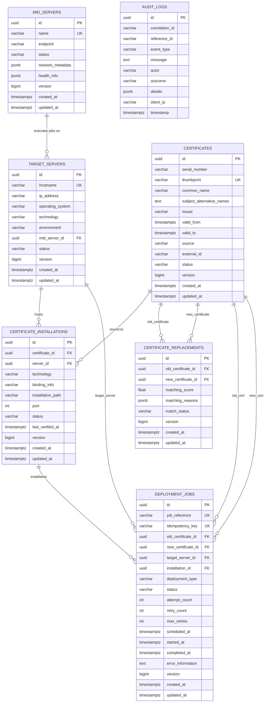
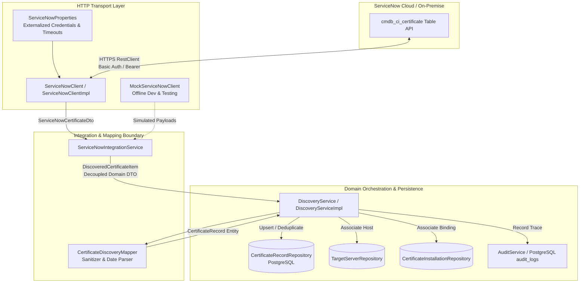

# Certificate Deployment Manager (CDM) — Core Service

The **Certificate Deployment Manager (CDM)** is an enterprise orchestration platform designed to automate the discovery, renewal matching, credential retrieval, MID Server dispatch, live verification, and auditing of SSL/TLS certificates across heterogeneous infrastructure (Windows IIS, Linux Apache/Nginx, and Java Keystores).

---

## Architecture Principles

- **CDM is the Orchestration & Decision-Making Layer**: CDM tracks certificate lifecycles, correlates discovered certificates to Sectigo renewals, retrieves deployment credentials just-in-time from CyberArk, and schedules deployment operations.
- **MID Server is the Execution Layer**: Deployment operations and scripts are dispatched to ServiceNow MID Servers. **Target servers must never be directly controlled by arbitrary or ad-hoc commands from the CDM backend.**
- **Least-Privilege Security**: Target credentials retrieved from CyberArk CCP/AIM are held transiently in memory and wiped immediately post-dispatch; they are never persisted or logged.
- **Audit-First**: Every state transition, discovery sync, credential acquisition, and verification is recorded into an append-only, tamper-evident audit trail.

---

## Technology Stack

- **Java 21**: Modern language features (Records, Pattern Matching, Sequenced Collections).
- **Spring Boot 3.4.2**: Core framework, Spring MVC, Spring Data JPA, Spring Security, Spring Boot Actuator.
- **PostgreSQL 16**: Relational persistence and JSONB metadata storage.
- **Flyway**: Version-controlled, reproducible database migrations (`db/migration/V1__initial_schema.sql`).
- **Spring Security 6**: Stateless authentication, role-based authorization, RFC 7807 error responses.
- **Springdoc OpenAPI / Swagger UI 3**: Interactive API documentation at `/swagger-ui/index.html`.
- **JUnit 5, Mockito & Testcontainers**: Unit and real-database integration testing.
- **Docker & Docker Compose**: Containerized database and production runtime.

---

## Project Structure & Architecture Packages

```
com.grassroots.cdm
├── CdmApplication.java                  # Main Spring Boot entry point
├── audit                                # Immutable audit trail and event domain
│   ├── AuditAction.java                 # Standard audit event types
│   ├── AuditEvent.java                  # Audit event payload
│   └── AuditService.java                # Audit publishing interface
├── configuration                        # Framework and subsystem configurations
│   ├── CdmSecurityProperties.java       # Security credentials binding
│   ├── JpaAuditingConfig.java           # JPA entity auditing configuration
│   ├── OpenApiConfig.java               # OpenAPI/Swagger 3 specification metadata
│   └── SecurityConfig.java              # Spring Security filter chain & RBAC
├── controller                           # REST API controllers (DTO boundaries)
│   └── SystemController.java            # Diagnostic and health inspection APIs
├── deployment                           # Deployment orchestration domain
│   ├── DeploymentDispatcher.java        # MID Server dispatch orchestrator contract
│   ├── DeploymentInstruction.java       # Parameterized MID server payload specification
│   ├── DeploymentJobStatus.java         # State machine statuses (PENDING, DISPATCHED, etc.)
│   └── TargetType.java                  # Supported targets (IIS, Apache, Nginx, JKS)
├── dto                                  # Data Transfer Objects (Records & DTOs)
│   ├── ApiResponse.java                 # Standard response wrapper
│   ├── AuditLogDto.java                 # Audit log view DTO
│   ├── CertificateInstallationDto.java  # Certificate installation view DTO
│   ├── CertificateReplacementDto.java   # Certificate replacement match view DTO
│   ├── CertificateSummaryDto.java       # Certificate view representation
│   ├── DeploymentJobDto.java            # Deployment job view representation
│   ├── ErrorResponse.java               # RFC-7807 error envelope
│   ├── MidServerDto.java                # MID server status & health view DTO
│   ├── SystemStatusDto.java             # Diagnostic status payload
│   ├── TargetServerDto.java             # Managed server view DTO
│   └── ValidationError.java             # Constraint violation item
├── discovery                            # Certificate discovery domain
│   ├── DiscoveryService.java            # Discovery orchestration contract
│   ├── impl/DiscoveryServiceImpl.java   # Production deduplication & upsert engine
│   └── mapper/CertificateDiscoveryMapper.java # Domain mapping and status resolution
├── dto                                  # Data Transfer Objects (Records & DTOs)
│   ├── ApiResponse.java                 # Standard response wrapper
│   ├── AuditLogDto.java                 # Audit log view DTO
│   ├── CertificateInstallationDto.java  # Certificate installation view DTO
│   ├── CertificateReplacementDto.java   # Certificate replacement match view DTO
│   ├── CertificateSummaryDto.java       # Certificate view representation
│   ├── DeploymentJobDto.java            # Deployment job view representation
│   ├── DiscoveryResultDto.java          # Discovery outcome summary DTO
│   ├── ErrorResponse.java               # RFC-7807 error envelope
│   ├── MidServerDto.java                # MID server status & health view DTO
│   ├── SystemStatusDto.java             # Diagnostic status payload
│   ├── TargetServerDto.java             # Managed server view DTO
│   └── ValidationError.java             # Constraint violation item
├── entity                               # JPA entities (Domain Model)
│   ├── AuditLogRecord.java              # audit_logs table entity
│   ├── BaseEntity.java                  # MappedSuperclass (UUID, version, audit timestamps)
│   ├── CertificateInstallation.java     # certificate_installations table entity
│   ├── CertificateRecord.java           # certificates table entity
│   ├── CertificateReplacement.java      # certificate_replacements table entity
│   ├── DeploymentJob.java               # deployment_jobs table entity
│   ├── MidServer.java                   # mid_servers table entity
│   ├── TargetServer.java                # target_servers table entity
│   └── enums                            # Domain Enums (String persisted)
│       ├── AuditOutcome.java            # SUCCESS, FAILURE, REJECTED, etc.
│       ├── CertificateSource.java       # SERVICENOW, SECTIGO, MANUAL, etc.
│       ├── CertificateStatus.java       # ACTIVE, EXPIRING, EXPIRED, REVOKED, etc.
│       ├── DeploymentType.java          # RENEWAL_REPLACEMENT, INITIAL_INSTALL, etc.
│       ├── EnvironmentType.java         # PRODUCTION, STAGING, QA, DEVELOPMENT
│       ├── InstallationStatus.java      # INSTALLED, PENDING_VERIFICATION, VERIFIED, etc.
│       ├── MatchStatus.java             # AUTO_MATCHED, MANUALLY_CONFIRMED, etc.
│       ├── MidServerStatus.java         # UP, DOWN, DEGRADED, PAUSED, MAINTENANCE
│       ├── ServerOperatingSystem.java   # WINDOWS_SERVER, LINUX_RHEL, etc.
│       ├── ServerStatus.java            # ACTIVE, MAINTENANCE, DECOMMISSIONED, etc.
│       └── ServerTechnology.java        # IIS, APACHE, NGINX, TOMCAT, JAVA_KEYSTORE
├── exception                            # Exception handling and translations
│   ├── CdmException.java                # Base application exception
│   ├── GlobalExceptionHandler.java      # Centralized REST exception translator
│   ├── IntegrationException.java        # External integration faults
│   ├── ResourceNotFoundException.java   # Missing resource 404
│   └── ValidationException.java         # Business constraint violation 400
├── integration                          # External system contract interfaces
│   ├── CredentialSecret.java            # Transient in-memory secret holder
│   ├── CyberArkVaultClient.java         # CyberArk credential retrieval contract
│   ├── MidServerClient.java             # ServiceNow MID Server queue contract
│   ├── SectigoClient.java               # Sectigo CA renewal contract
│   ├── ServiceNowClient.java            # Legacy bridge interface
│   └── servicenow                       # ServiceNow CMDB Integration Module
│       ├── ServiceNowClient.java        # Modern HTTP client interface
│       ├── ServiceNowIntegrationService.java # Isolated domain integration service
│       ├── client/ServiceNowClientImpl.java  # Spring RestClient implementation
│       ├── config/ServiceNowProperties.java  # Externalized config binding
│       ├── dto                          # Table API DTOs & envelopes
│       │   ├── ServiceNowCertificateDto.java
│       │   ├── ServiceNowErrorResponse.java
│       │   └── ServiceNowTableResponse.java
│       ├── exception                    # Dedicated ServiceNow exception hierarchy
│       │   ├── ServiceNowAuthenticationException.java
│       │   ├── ServiceNowClientException.java
│       │   ├── ServiceNowException.java
│       │   ├── ServiceNowParseException.java
│       │   ├── ServiceNowRateLimitException.java
│       │   ├── ServiceNowServerException.java
│       │   └── ServiceNowTimeoutException.java
│       ├── mock/MockServiceNowClient.java    # Offline dev & test mock client
│       ├── model/DiscoveredCertificateItem.java # Decoupled integration model
│       └── service/ServiceNowIntegrationServiceImp.java
├── matching                             # Certificate correlation engine
│   ├── CertificateMatcher.java          # Matching strategy contract
│   └── MatchResult.java                 # Match evaluation outcome
├── repository                           # Spring Data JPA repositories
│   ├── AuditLogRecordRepository.java
│   ├── CertificateInstallationRepository.java
│   ├── CertificateRecordRepository.java
│   ├── CertificateReplacementRepository.java
│   ├── DeploymentJobRepository.java
│   ├── MidServerRepository.java
│   └── TargetServerRepository.java
├── security                             # Authentication & authorization handlers
│   ├── CustomAccessDeniedHandler.java   # 403 Forbidden JSON handler
│   └── CustomAuthenticationEntryPoint.java # 401 Unauthorized JSON handler
├── service                              # Business service abstractions
│   ├── SystemService.java               # Platform diagnostics interface
│   └── impl/SystemServiceImpl.java      # System diagnostic implementation
├── verification                         # Verification contracts
│   ├── EndpointVerifier.java            # Live TLS endpoint handshake verification
│   ├── NextDayDiscoveryVerifier.java    # ServiceNow discovery reconciliation
│   └── VerificationResult.java          # Handshake validation result
└── workflow                             # Multi-step state machine engine
    ├── WorkflowContext.java             # Contextual workflow state
    └── WorkflowEngine.java              # Step execution engine contract
```


---

## Domain Model & Database Architecture

The Certificate Deployment Manager (CDM) database schema is version-controlled via **Flyway** and backed by **PostgreSQL 15/16** with strong relational integrity, composite unique constraints, indexes for query performance, and JSONB columns for semi-structured metadata.

### 1. Entity-Relationship Diagram (ERD)



### 2. Core Entities & Schema Specifications

| Table | Description | Primary Key | Key Constraints & Indexes |
|---|---|---|---|
| [`certificates`](file:///Users/ayushyadav/CDm-repo_gressroots/src/main/java/com/grassroots/cdm/entity/CertificateRecord.java) | Master inventory of discovered (ServiceNow) and renewed (Sectigo) certificates. | `UUID` | Unique: `thumbprint`, `fingerprint_sha256`. Indexes: `common_name`, `valid_to`, `serial_number`, `status`, `source`. |
| [`mid_servers`](file:///Users/ayushyadav/CDm-repo_gressroots/src/main/java/com/grassroots/cdm/entity/MidServer.java) | ServiceNow MID Server nodes responsible for dispatching commands to target machines. | `UUID` | Unique: `name`. Index: `status`. Includes `network_metadata` (JSONB) and `health_info` (JSONB). |
| [`target_servers`](file:///Users/ayushyadav/CDm-repo_gressroots/src/main/java/com/grassroots/cdm/entity/TargetServer.java) | Managed endpoints (Windows IIS, Linux Apache/Nginx, Java containers). | `UUID` | Unique: `hostname`. Indexes: `mid_server_id`, `status`, `environment`, `technology`. Foreign Key: `mid_server_id` (`ON DELETE SET NULL`). |
| [`certificate_installations`](file:///Users/ayushyadav/CDm-repo_gressroots/src/main/java/com/grassroots/cdm/entity/CertificateInstallation.java) | Active binding of a certificate to a server port, binding path, or virtual host. | `UUID` | Unique Compound: `(server_id, port, binding_info)`. Indexes: `certificate_id`, `server_id`, `status`. Foreign Keys: `certificate_id` (`ON DELETE CASCADE`), `server_id` (`ON DELETE CASCADE`). |
| [`certificate_replacements`](file:///Users/ayushyadav/CDm-repo_gressroots/src/main/java/com/grassroots/cdm/entity/CertificateReplacement.java) | Correlated pairing of an expiring certificate with its renewed Sectigo candidate. | `UUID` | Unique Compound: `(old_certificate_id, new_certificate_id)`. Indexes: `old_certificate_id`, `new_certificate_id`, `match_status`. Includes `matching_reasons` (JSONB). |
| [`deployment_jobs`](file:///Users/ayushyadav/CDm-repo_gressroots/src/main/java/com/grassroots/cdm/entity/DeploymentJob.java) | Orchestration state machine tracking deployment lifecycle, execution retries, and errors. | `UUID` | Unique: `job_reference`, `idempotency_key`. Indexes: `status`, `target_server_id`, `installation_id`, `deployment_type`, `scheduled_at`. Foreign Keys: `target_server_id` (`ON DELETE RESTRICT`), `old/new_certificate_id` (`ON DELETE SET NULL`), `installation_id` (`ON DELETE SET NULL`). |
| [`audit_logs`](file:///Users/ayushyadav/CDm-repo_gressroots/src/main/java/com/grassroots/cdm/entity/AuditLogRecord.java) | Immutable, append-only security and orchestration audit trail. | `UUID` | Indexes: `correlation_id`, `event_type`, `reference_id`, `timestamp`, `action`. Semi-structured `details` (JSONB). |

### 3. Flyway Migrations

Database schema evolutions are managed strictly through Flyway scripts located in [`src/main/resources/db/migration/`](file:///Users/ayushyadav/CDm-repo_gressroots/src/main/resources/db/migration):

- [`V1__initial_schema.sql`](file:///Users/ayushyadav/CDm-repo_gressroots/src/main/resources/db/migration/V1__initial_schema.sql): Baseline tables (`certificates`, `deployment_jobs`, `audit_logs`).
- [`V2__comprehensive_domain_model.sql`](file:///Users/ayushyadav/CDm-repo_gressroots/src/main/resources/db/migration/V2__comprehensive_domain_model.sql): Adds `mid_servers`, `target_servers`, `certificate_installations`, `certificate_replacements`, enhances `deployment_jobs` with `idempotency_key` and FK relations, adds `correlation_id` and `event_type` to `audit_logs`, and applies unique composite constraints and performance indexes.

To run migrations locally:
```bash
./mvnw org.flywaydb:flyway-maven-plugin:migrate \
  -Dflyway.url=jdbc:postgresql://localhost:5432/cdm_db \
  -Dflyway.user=cdm_user \
  -Dflyway.password=cdm_password_change_me \
  -Dflyway.locations=filesystem:src/main/resources/db/migration
```

### 4. Database Relationships & Entity Graph

1. **MID Server to Target Server (1 : N)**:
   - A `MidServer` manages multiple `TargetServer` endpoints based on network routing and VPC boundaries.
   - Relationship is `FetchType.LAZY` with `ON DELETE SET NULL`. If a MID Server node is retired or relocated, target server records remain intact.

2. **Certificate to Certificate Installation (1 : N)**:
   - A single certificate (especially wildcard or multi-SAN certificates) can be installed across multiple target servers, ports, and sites.
   - Deleting a certificate cascades deletion to its installation records (`ON DELETE CASCADE`).

3. **Target Server to Certificate Installation (1 : N)**:
   - A target server can host multiple certificates across different ports (e.g. 443, 8443) or different SNI virtual hosts.
   - Deleting a target server cascades deletion to its installations (`ON DELETE CASCADE`).

4. **Old Certificate to New Certificate Replacement (1 : N / Pairwise Unique)**:
   - `CertificateReplacement` tracks renewal candidates matched by the matching engine.
   - Enforced by unique constraint `uq_cert_replacement_pair (old_certificate_id, new_certificate_id)` to prevent redundant evaluation pairs.

5. **Deployment Job Orchestration Graph**:
   - `DeploymentJob` connects the `TargetServer`, `CertificateInstallation`, `oldCertificate`, and `newCertificate`.
   - Protected by `ON DELETE RESTRICT` on `target_server_id` (active jobs cannot leave orphaned targets).
   - Enforces uniqueness on `idempotency_key` to guarantee duplicate webhook or API requests do not trigger repeated dispatches.

6. **Audit Trail Decoupling**:
   - `AuditLogRecord` is deliberately not bound by relational foreign keys to business tables.
   - Instead, it stores `correlation_id` (distributed trace ID) and `reference_id` (entity ID / job reference). This guarantees the audit log is strictly append-only and retains full forensic history even if underlying entities are pruned.

### 5. Architectural Design Decisions & Assumptions

1. **UUID Primary Keys Everywhere**:
   - All entities inherit from [`BaseEntity`](file:///Users/ayushyadav/CDm-repo_gressroots/src/main/java/com/grassroots/cdm/entity/BaseEntity.java) using RFC 4122 UUID primary keys generated via `gen_random_uuid()`. This prevents enumeration attacks and supports seamless cross-datacenter replication without auto-increment collisions.

2. **Optimistic Locking (`@Version BIGINT`)**:
   - All stateful mutable entities include a `@Version` field (`BIGINT NOT NULL DEFAULT 0`).
   - Ensures that concurrent background polling, MID Server status updates, and user approvals do not overwrite each other silently.

3. **String Enum Persistence**:
   - All domain enums (`CertificateStatus`, `DeploymentJobStatus`, `ServerTechnology`, `ServerOperatingSystem`, etc.) are mapped with `@Enumerated(EnumType.STRING)` as `VARCHAR(50)` columns.
   - Avoids fragile ordinal mapping and native PostgreSQL ENUM types, enabling forward-compatible enum evolution without complex schema locks.

4. **Strict Lazy Loading (`FetchType.LAZY`)**:
   - All `@ManyToOne` and `@OneToMany` relationships use `FetchType.LAZY` to prevent N+1 queries and accidental Cartesian product loading across complex orchestration graphs.

5. **Zero Credential Persistence**:
   - In accordance with enterprise security standards, **no passwords, private keys, or credentials are stored in PostgreSQL**.
   - Deployment credentials are fetched just-in-time from CyberArk CCP/AIM, kept in transient memory (`char[]`), and zeroed immediately after dispatch.

6. **Dynamic JSONB Columns for Metadata**:
   - `health_info` and `network_metadata` on `mid_servers`, `matching_reasons` on `certificate_replacements`, and `details` on `audit_logs` use PostgreSQL `JSONB` mapped via Hibernate `@JdbcTypeCode(SqlTypes.JSON)`.
   - Provides schema flexibility for arbitrary diagnostic payloads without table alterations.

---

## ServiceNow Certificate Discovery Module

The ServiceNow discovery module is responsible for inventorying SSL/TLS certificates discovered across the enterprise infrastructure (`cmdb_ci_certificate`) and synchronizing them into the CDM PostgreSQL repository with strict deduplication, in-place metadata updates, and tamper-evident audit trails.

### 1. Discovery Architecture & Data Flow



### 2. Execution Pipeline & Key Features

1. **Decoupled 4-Tier Architecture**:
   - `ServiceNowClient`: Strictly handles HTTP transport, timeouts, rate limits, exponential backoff retries, and deserialization using modern Spring 6 `RestClient` and `JdkClientHttpRequestFactory`.
   - `ServiceNowIntegrationService`: Validates data completeness, parses heterogeneous date formats, normalizes thumbprints, and maps to `DiscoveredCertificateItem` so that ServiceNow Table API JSON never leaks into the core domain layer.
   - `DiscoveryService`: Orchestrates the discovery transaction, applies deduplication algorithms, updates existing certificates in place, links servers and installations, and records compliance audit trails.
   - `CertificateRecordRepository`: PostgreSQL persistence layer.

2. **Deduplication & In-Place Upsert**:
   - Prevents duplicate certificate records during repeated discovery runs.
   - Lookups evaluate in order:
     1. External ServiceNow `sys_id`
     2. SHA-256 / SHA-1 `thumbprint` (case-insensitive)
     3. Certificate `serial_number` + `issuer`
   - If an existing record is matched, its validity dates, subject alternative names, and operational status are updated in place with optimistic locking (`@Version`) without modifying its persistent UUID.
   - If missing, a new `CertificateRecord` entity is generated with `source = SERVICENOW`.

3. **Resilient Data Sanitization & Deterministic Fingerprints**:
   - Parses diverse ServiceNow date patterns (`yyyy-MM-dd HH:mm:ss`, ISO-8601, `yyyy-MM-dd`).
   - If a legacy ServiceNow certificate record lacks an explicit thumbprint, a cryptographic SHA-256 fingerprint is deterministically derived from `sys_id|serial_number|common_name` to prevent collisions.
   - Cleans colons and whitespace from thumbprints (`AA:BB:CC...` -> `AABBCC...`).

4. **Transient Zero-Credential & Private Key Security**:
   - No private keys or server credentials are ever accepted, requested, or persisted during discovery.
   - External ServiceNow credentials (username, password, client secret, bearer token) are injected via `@ConfigurationProperties(prefix = "cdm.servicenow")` and never logged.

5. **Fault Tolerance & Resilience**:
   - **Authentication Failure (401/403)**: Immediately caught and mapped to `ServiceNowAuthenticationException`.
   - **Rate Limiting (429)**: Respects `Retry-After` header and retries with backoff up to `maxRetries`.
   - **Service Unavailable (503/504)**: Retries with exponential backoff before throwing `ServiceNowServerException`.
   - **Connection/Read Timeout**: Mapped to `ServiceNowTimeoutException`.
   - **Malformed JSON**: Mapped to `ServiceNowParseException`.
   - All failures emit structured audit logs with distributed `correlation_id`.

6. **Local Development & Mock Mode**:
   - Enabled out-of-the-box in `application-local.yml` (`cdm.servicenow.mock-enabled=true`).
   - Provides an in-memory `MockServiceNowClient` allowing developers to run offline without live ServiceNow instances.
   - Fully tested with real HTTP wire protocols via WireMock (`ServiceNowClientWireMockTest`).

---

## Running the Codebase Locally

### 1. Prerequisites

Ensure you have the following installed on your machine:

- **Java (JDK) 21+**: Verify with `java -version`
- **Maven 3.9+** (or use included `./mvnw`): Verify with `./mvnw -version`
- **Docker & Docker Desktop**: Verify with `docker --version`
- **PostgreSQL** *(only needed if running database natively without Docker)*

---

### 2. Setting Up the Database

You can run PostgreSQL either through **Docker** or as a **local native service**.

#### Option A: Using Docker (Quickest & Recommended)

Start the PostgreSQL 16 container:

```bash
docker compose up -d postgres
```

To stop PostgreSQL later:
```bash
docker compose stop postgres
```

#### Option B: Using Native Local PostgreSQL

If you run PostgreSQL directly on macOS (e.g., Homebrew) or Linux:

1. Connect to PostgreSQL:
   ```bash
   psql -U $(whoami) -d postgres
   ```

2. Execute SQL setup:
   ```sql
   -- Create CDM database
   CREATE DATABASE cdm_db;

   -- Create application user
   CREATE ROLE cdm_user WITH LOGIN PASSWORD 'cdm_password_change_me';

   -- Grant privileges
   GRANT ALL PRIVILEGES ON DATABASE cdm_db TO cdm_user;
   \c cdm_db
   GRANT ALL ON SCHEMA public TO cdm_user;
   GRANT ALL PRIVILEGES ON ALL TABLES IN SCHEMA public TO cdm_user;
   ```

3. Test connection:
   ```bash
   PGPASSWORD=cdm_password_change_me psql -h localhost -U cdm_user -d cdm_db -c "SELECT current_user, current_database();"
   ```

---

### 3. Local Environment Configuration (`.env`)

The project uses `.env` for local configuration overrides (ignored by Git to keep secrets safe):

```bash
cp .env.example .env
```

Default configuration for local development:
```env
SPRING_PROFILES_ACTIVE=local
SERVER_PORT=8085
LOG_LEVEL_CDM=DEBUG

DB_HOST=localhost
DB_PORT=5432
DB_NAME=cdm_db
DB_USERNAME=cdm_user
DB_PASSWORD=cdm_password_change_me

SECURITY_BASIC_USERNAME=cdm_admin
SECURITY_BASIC_PASSWORD=admin_dev_password_change_me
```

> [!NOTE]
> The default local server port is configured to **`8085`** in `application-local.yml` to prevent port collisions with other local services or Docker containers bound to port `8080`.

---

### 4. Starting the Application

#### Method 1: Using Maven Wrapper (Standard Development Mode)

```bash
SPRING_PROFILES_ACTIVE=local ./mvnw spring-boot:run
```

The application will start in ~3–4 seconds. You will see:
- Flyway automatically applies migration `V1__initial_schema.sql`
- JPA repositories initialized
- Tomcat started on port **`8085`**

#### Method 2: Running via Docker Compose (Full Stack)

To run both PostgreSQL and the containerized Spring Boot application:

```bash
docker compose up --build -d
```

Stream application logs:
```bash
docker compose logs -f cdm-app
```

To stop all services:
```bash
docker compose down
```

#### Method 3: Running Packaged JAR

```bash
./mvnw clean package -DskipTests
java -jar target/cdm-core-0.0.1-SNAPSHOT.jar --spring.profiles.active=local
```

---

### 5. Verifying the Running Application

With the server running on port `8085`, verify endpoints using `curl`:

#### A. System Diagnostics & Database Connectivity
```bash
curl -s http://localhost:8085/api/v1/system/status | jq .
```
```json
{
  "success": true,
  "message": "System status retrieved successfully",
  "data": {
    "applicationName": "cdm-core",
    "version": "1.0.0",
    "status": "HEALTHY",
    "serverTime": "2026-09-26T15:47:17.811Z",
    "javaVersion": "24.0.1",
    "components": {
      "database": "UP (PostgreSQL ...)",
      "security": "ENFORCED (Stateless Basic / RBAC)",
      "flyway": "MIGRATIONS_APPLIED",
      "orchestration": "READY"
    }
  },
  "timestamp": "2026-09-26T15:47:17.814647Z"
}
```

#### B. Lightweight Ping Check
```bash
curl -s http://localhost:8085/api/v1/system/ping | jq .
```
```json
{
  "success": true,
  "message": "Ping successful",
  "data": "pong"
}
```

#### C. Spring Boot Actuator Health Probe
```bash
curl -s http://localhost:8085/actuator/health | jq .
```
```json
{
  "status": "UP",
  "components": {
    "db": {
      "status": "UP"
    }
  }
}
```

#### D. Interactive Swagger UI & OpenAPI Specification
- **Swagger UI Console**: [http://localhost:8085/swagger-ui/index.html](http://localhost:8085/swagger-ui/index.html)
- **OpenAPI 3.0 JSON Spec**: [http://localhost:8085/v3/api-docs](http://localhost:8085/v3/api-docs)

#### E. Spring Security Verification
1. **Unauthenticated access to protected endpoint (Expect 401)**:
   ```bash
   curl -i http://localhost:8085/api/v1/jobs
   ```
   *Returns HTTP 401 Unauthorized in RFC 7807 error format.*

2. **Authenticated access using Basic Auth credentials**:
   ```bash
   curl -i -u cdm_admin:admin_dev_password_change_me http://localhost:8085/api/v1/system/status
   ```
   *Returns HTTP 200 OK.*

---

## 6. Testing with Postman & Newman

A complete Postman collection and environment are pre-configured in the [`postman/`](file:///Users/ayushyadav/CDm-repo_gressroots/postman) folder:

- Collection: [`postman/CDM_API_Collection.postman_collection.json`](file:///Users/ayushyadav/CDm-repo_gressroots/postman/CDM_API_Collection.postman_collection.json)
- Environment: [`postman/CDM_Local.postman_environment.json`](file:///Users/ayushyadav/CDm-repo_gressroots/postman/CDM_Local.postman_environment.json)
- Raw OpenAPI Spec: [`postman/cdm-openapi.json`](file:///Users/ayushyadav/CDm-repo_gressroots/postman/cdm-openapi.json)

### Importing into Postman:
1. Open Postman and click **Import** (top left).
2. Drag and drop both JSON files from `postman/`.
3. Select **CDM Local Environment** in the top-right environment selector.
4. Click **Run collection** to run all automated test assertions.

### Running via CLI (Newman):
```bash
npx -y newman run postman/CDM_API_Collection.postman_collection.json \
  -e postman/CDM_Local.postman_environment.json
```

---

## 7. Running the Automated Test Suite

CDM uses **Testcontainers** to launch an isolated PostgreSQL container automatically during integration test runs.

Run all unit tests and integration tests:
```bash
./mvnw clean test
```

Expected output:
```text
[INFO] Running com.grassroots.cdm.ActuatorAndOpenApiIntegrationTest
[INFO] Tests run: 3, Failures: 0, Errors: 0, Skipped: 0
[INFO] Running com.grassroots.cdm.integration.servicenow.ServiceNowClientWireMockTest
[INFO] Tests run: 8, Failures: 0, Errors: 0, Skipped: 0
[INFO] Running com.grassroots.cdm.discovery.DiscoveryServiceIntegrationTest
[INFO] Tests run: 8, Failures: 0, Errors: 0, Skipped: 0
[INFO] Running com.grassroots.cdm.repository.DatabaseMigrationAndRepositoryIntegrationTest
[INFO] Tests run: 9, Failures: 0, Errors: 0, Skipped: 0
[INFO] Running com.grassroots.cdm.controller.SystemControllerTest
[INFO] Tests run: 2, Failures: 0, Errors: 0, Skipped: 0
[INFO] Running com.grassroots.cdm.service.SystemServiceImplTest
[INFO] Tests run: 3, Failures: 0, Errors: 0, Skipped: 0
[INFO] Running com.grassroots.cdm.exception.GlobalExceptionHandlerTest
[INFO] Tests run: 4, Failures: 0, Errors: 0, Skipped: 0
[INFO] Running com.grassroots.cdm.CdmApplicationTests
[INFO] Tests run: 1, Failures: 0, Errors: 0, Skipped: 0
[INFO] 
[INFO] Results:
[INFO] Tests run: 38, Failures: 0, Errors: 0, Skipped: 0
[INFO] BUILD SUCCESS
```

---

## 8. Common Troubleshooting

| Issue | Cause | Resolution |
|---|---|---|
| `Port 8085 already in use` | Another process is using port 8085. | Update `SERVER_PORT=8090` in `.env` or run `SERVER_PORT=8090 ./mvnw spring-boot:run`. |
| `FATAL: password authentication failed for user "cdm_user"` | Local PostgreSQL user password mismatch. | Verify credentials in `.env` match your PostgreSQL instance, or use `docker compose up -d postgres`. |
| `Connection refused: localhost:5432` | PostgreSQL is not started. | Start PostgreSQL with `docker compose up -d postgres` or `brew services start postgresql@16`. |
| `Docker daemon is not running` (during `./mvnw test`) | Docker Desktop is not started. | Open Docker Desktop (`open -a Docker` on macOS). |
