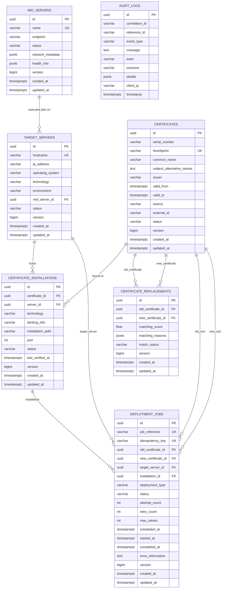
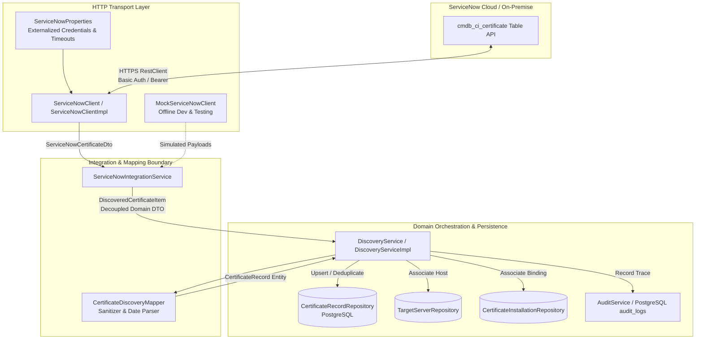
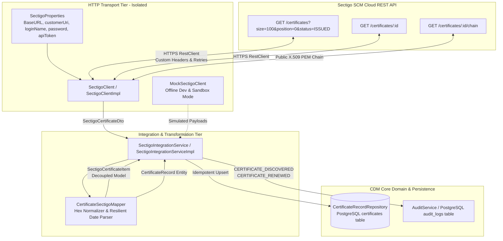
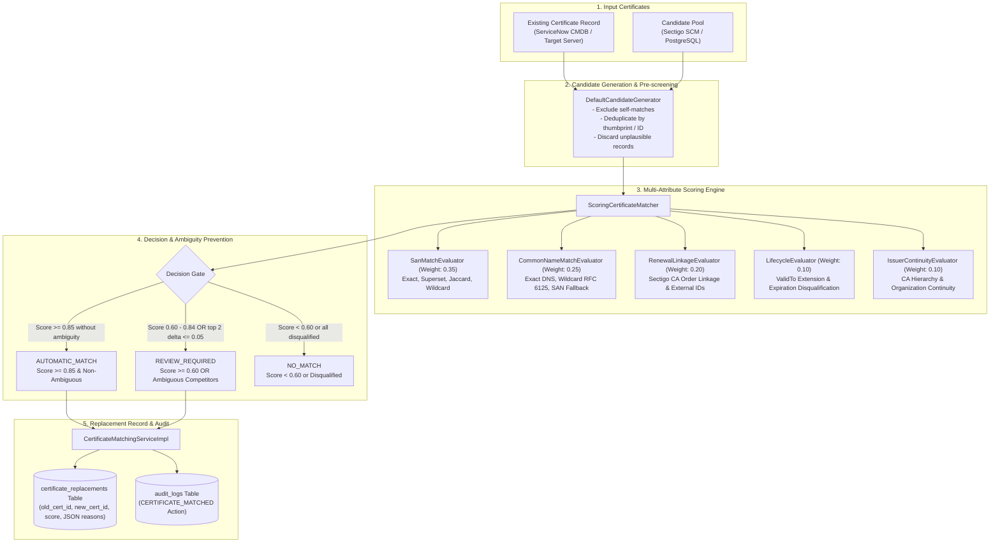

# Certificate Deployment Manager (CDM) — Core Service

The **Certificate Deployment Manager (CDM)** is an enterprise orchestration platform designed to automate the discovery, renewal matching, credential retrieval, MID Server dispatch, live verification, and auditing of SSL/TLS certificates across heterogeneous infrastructure (Windows IIS, Linux Apache/Nginx, and Java Keystores).

---

## Architecture Principles

- **CDM is the Orchestration & Decision-Making Layer**: CDM tracks certificate lifecycles, correlates discovered certificates to Sectigo renewals, retrieves deployment credentials just-in-time from CyberArk, and schedules deployment operations.
- **MID Server is the Execution Layer**: Deployment operations and scripts are dispatched to ServiceNow MID Servers. **Target servers must never be directly controlled by arbitrary or ad-hoc commands from the CDM backend.**
- **Least-Privilege Security**: Target credentials retrieved from CyberArk CCP/AIM are held transiently in memory and wiped immediately post-dispatch; they are never persisted or logged.
- **Audit-First**: Every state transition, discovery sync, credential acquisition, and verification is recorded into an append-only, tamper-evident audit trail.

---

## Technology Stack

- **Java 21**: Modern language features (Records, Pattern Matching, Sequenced Collections).
- **Spring Boot 3.4.2**: Core framework, Spring MVC, Spring Data JPA, Spring Security, Spring Boot Actuator.
- **PostgreSQL 16**: Relational persistence and JSONB metadata storage.
- **Flyway**: Version-controlled, reproducible database migrations (`db/migration/V1__initial_schema.sql`).
- **Spring Security 6**: Stateless authentication, role-based authorization, RFC 7807 error responses.
- **Springdoc OpenAPI / Swagger UI 3**: Interactive API documentation at `/swagger-ui/index.html`.
- **JUnit 5, Mockito & Testcontainers**: Unit and real-database integration testing.
- **Docker & Docker Compose**: Containerized database and production runtime.

---

## Project Structure & Architecture Packages

```
com.grassroots.cdm
├── CdmApplication.java                  # Main Spring Boot entry point
├── audit                                # Immutable audit trail and event domain
│   ├── AuditAction.java                 # Standard audit event types
│   ├── AuditEvent.java                  # Audit event payload
│   └── AuditService.java                # Audit publishing interface
├── configuration                        # Framework and subsystem configurations
│   ├── CdmSecurityProperties.java       # Security credentials binding
│   ├── JpaAuditingConfig.java           # JPA entity auditing configuration
│   ├── OpenApiConfig.java               # OpenAPI/Swagger 3 specification metadata
│   └── SecurityConfig.java              # Spring Security filter chain & RBAC
├── controller                           # REST API controllers (DTO boundaries)
│   └── SystemController.java            # Diagnostic and health inspection APIs
├── deployment                           # Deployment orchestration domain
│   ├── DeploymentDispatcher.java        # MID Server dispatch orchestrator contract
│   ├── DeploymentInstruction.java       # Parameterized MID server payload specification
│   ├── DeploymentJobStatus.java         # State machine statuses (PENDING, DISPATCHED, etc.)
│   └── TargetType.java                  # Supported targets (IIS, Apache, Nginx, JKS)
├── dto                                  # Data Transfer Objects (Records & DTOs)
│   ├── ApiResponse.java                 # Standard response wrapper
│   ├── AuditLogDto.java                 # Audit log view DTO
│   ├── CertificateInstallationDto.java  # Certificate installation view DTO
│   ├── CertificateReplacementDto.java   # Certificate replacement match view DTO
│   ├── CertificateSummaryDto.java       # Certificate view representation
│   ├── DeploymentJobDto.java            # Deployment job view representation
│   ├── ErrorResponse.java               # RFC-7807 error envelope
│   ├── MidServerDto.java                # MID server status & health view DTO
│   ├── SystemStatusDto.java             # Diagnostic status payload
│   ├── TargetServerDto.java             # Managed server view DTO
│   └── ValidationError.java             # Constraint violation item
├── discovery                            # Certificate discovery domain
│   ├── DiscoveryService.java            # Discovery orchestration contract
│   ├── impl/DiscoveryServiceImpl.java   # Production deduplication & upsert engine
│   └── mapper/CertificateDiscoveryMapper.java # Domain mapping and status resolution
├── dto                                  # Data Transfer Objects (Records & DTOs)
│   ├── ApiResponse.java                 # Standard response wrapper
│   ├── AuditLogDto.java                 # Audit log view DTO
│   ├── CertificateInstallationDto.java  # Certificate installation view DTO
│   ├── CertificateReplacementDto.java   # Certificate replacement match view DTO
│   ├── CertificateSummaryDto.java       # Certificate view representation
│   ├── DeploymentJobDto.java            # Deployment job view representation
│   ├── DiscoveryResultDto.java          # Discovery outcome summary DTO
│   ├── ErrorResponse.java               # RFC-7807 error envelope
│   ├── MidServerDto.java                # MID server status & health view DTO
│   ├── SystemStatusDto.java             # Diagnostic status payload
│   ├── TargetServerDto.java             # Managed server view DTO
│   └── ValidationError.java             # Constraint violation item
├── entity                               # JPA entities (Domain Model)
│   ├── AuditLogRecord.java              # audit_logs table entity
│   ├── BaseEntity.java                  # MappedSuperclass (UUID, version, audit timestamps)
│   ├── CertificateInstallation.java     # certificate_installations table entity
│   ├── CertificateRecord.java           # certificates table entity
│   ├── CertificateReplacement.java      # certificate_replacements table entity
│   ├── DeploymentJob.java               # deployment_jobs table entity
│   ├── MidServer.java                   # mid_servers table entity
│   ├── TargetServer.java                # target_servers table entity
│   └── enums                            # Domain Enums (String persisted)
│       ├── AuditOutcome.java            # SUCCESS, FAILURE, REJECTED, etc.
│       ├── CertificateSource.java       # SERVICENOW, SECTIGO, MANUAL, etc.
│       ├── CertificateStatus.java       # ACTIVE, EXPIRING, EXPIRED, REVOKED, etc.
│       ├── DeploymentType.java          # RENEWAL_REPLACEMENT, INITIAL_INSTALL, etc.
│       ├── EnvironmentType.java         # PRODUCTION, STAGING, QA, DEVELOPMENT
│       ├── InstallationStatus.java      # INSTALLED, PENDING_VERIFICATION, VERIFIED, etc.
│       ├── MatchStatus.java             # AUTO_MATCHED, MANUALLY_CONFIRMED, etc.
│       ├── MidServerStatus.java         # UP, DOWN, DEGRADED, PAUSED, MAINTENANCE
│       ├── ServerOperatingSystem.java   # WINDOWS_SERVER, LINUX_RHEL, etc.
│       ├── ServerStatus.java            # ACTIVE, MAINTENANCE, DECOMMISSIONED, etc.
│       └── ServerTechnology.java        # IIS, APACHE, NGINX, TOMCAT, JAVA_KEYSTORE
├── exception                            # Exception handling and translations
│   ├── CdmException.java                # Base application exception
│   ├── GlobalExceptionHandler.java      # Centralized REST exception translator
│   ├── IntegrationException.java        # External integration faults
│   ├── ResourceNotFoundException.java   # Missing resource 404
│   └── ValidationException.java         # Business constraint violation 400
├── integration                          # External system contract interfaces
│   ├── CredentialSecret.java            # Transient in-memory secret holder
│   ├── CyberArkVaultClient.java         # CyberArk credential retrieval contract
│   ├── MidServerClient.java             # ServiceNow MID Server queue contract
│   ├── SectigoClient.java               # Sectigo CA renewal contract
│   ├── ServiceNowClient.java            # Legacy bridge interface
│   ├── sectigo                          # Sectigo Certificate Manager (SCM) Module
│   │   ├── SectigoClient.java           # Modern HTTP client interface
│   │   ├── SectigoIntegrationService.java # Domain integration & sync service
│   │   ├── client/SectigoClientImpl.java # Production RestClient with retries
│   │   ├── config/SectigoProperties.java # Externalized config binding
│   │   ├── dto                          # Sectigo DTOs & envelope schemas
│   │   │   ├── SectigoCertificateDto.java
│   │   │   ├── SectigoErrorResponse.java
│   │   │   ├── SectigoPageResponse.java
│   │   │   └── StringListOrStringDeserializer.java
│   │   ├── exception                    # Dedicated Sectigo exception hierarchy
│   │   │   ├── SectigoAuthenticationException.java
│   │   │   ├── SectigoClientException.java
│   │   │   ├── SectigoException.java
│   │   │   ├── SectigoParseException.java
│   │   │   ├── SectigoRateLimitException.java
│   │   │   ├── SectigoServerException.java
│   │   │   └── SectigoTimeoutException.java
│   │   ├── mapper/CertificateSectigoMapper.java # Normalization and entity mapper
│   │   ├── mock/MockSectigoClient.java  # Offline dev & test mock client
│   │   ├── model/SectigoCertificateItem.java # Decoupled intermediate model
│   │   └── service/SectigoIntegrationServiceImpl.java # Production sync engine
│   └── servicenow                       # ServiceNow CMDB Integration Module
│       ├── ServiceNowClient.java        # Modern HTTP client interface
│       ├── ServiceNowIntegrationService.java # Isolated domain integration service
│       ├── client/ServiceNowClientImpl.java  # Spring RestClient implementation
│       ├── config/ServiceNowProperties.java  # Externalized config binding
│       ├── dto                          # Table API DTOs & envelopes
│       │   ├── ServiceNowCertificateDto.java
│       │   ├── ServiceNowErrorResponse.java
│       │   └── ServiceNowTableResponse.java
│       ├── exception                    # Dedicated ServiceNow exception hierarchy
│       │   ├── ServiceNowAuthenticationException.java
│       │   ├── ServiceNowClientException.java
│       │   ├── ServiceNowException.java
│       │   ├── ServiceNowParseException.java
│       │   ├── ServiceNowRateLimitException.java
│       │   ├── ServiceNowServerException.java
│       │   └── ServiceNowTimeoutException.java
│       ├── mock/MockServiceNowClient.java    # Offline dev & test mock client
│       ├── model/DiscoveredCertificateItem.java # Decoupled integration model
│       └── service/ServiceNowIntegrationServiceImp.java
├── matching                             # Certificate correlation & matching engine
│   ├── CertificateMatcher.java          # Matching strategy contract
│   ├── MatchResult.java                 # Match evaluation outcome
│   ├── config/MatchingProperties.java   # Configurable thresholds and signal weights
│   ├── evaluator                        # Multi-attribute signal evaluators
│   │   ├── MatchSignalEvaluator.java    # Evaluator strategy interface
│   │   └── impl/
│   │       ├── CommonNameMatchEvaluator.java # CN equality & wildcard matching
│   │       ├── IssuerContinuityEvaluator.java # CA organization continuity
│   │       ├── LifecycleEvaluator.java  # Validity extension & expiration check
│   │       ├── RenewalLinkageEvaluator.java # Sectigo CA renewal order linkage
│   │       └── SanMatchEvaluator.java   # SAN set similarity & superset matching
│   ├── generator                        # Candidate pre-screening & generation
│   │   ├── CandidateGenerator.java      # Candidate generation contract
│   │   └── impl/DefaultCandidateGenerator.java # Deduplication & self-exclusion
│   ├── impl/ScoringCertificateMatcher.java # Deterministic scoring & ambiguity handler
│   ├── model                            # Match model & evaluation records
│   │   ├── CandidateMatchResult.java    # Final matching result with JSON telemetry
│   │   ├── MatchDecision.java           # AUTOMATIC_MATCH, REVIEW_REQUIRED, NO_MATCH
│   │   ├── MatchReason.java             # Individual signal score breakdown
│   │   ├── MatchSignal.java             # Signal type categorization enum
│   │   └── ScoredCandidate.java         # Ranked candidate with tie-breakers
│   ├── normalizer/DomainNameNormalizer.java # RFC-compliant DNS & wildcard parsing
│   └── service                          # Matching orchestration & persistence
│       ├── CertificateMatchingService.java # Orchestration contract
│       └── impl/CertificateMatchingServiceImpl.java # Replacement & audit persistence
├── repository                           # Spring Data JPA repositories
│   ├── AuditLogRecordRepository.java
│   ├── CertificateInstallationRepository.java
│   ├── CertificateRecordRepository.java
│   ├── CertificateReplacementRepository.java
│   ├── DeploymentJobRepository.java
│   ├── MidServerRepository.java
│   └── TargetServerRepository.java
├── security                             # Authentication & authorization handlers
│   ├── CustomAccessDeniedHandler.java   # 403 Forbidden JSON handler
│   └── CustomAuthenticationEntryPoint.java # 401 Unauthorized JSON handler
├── service                              # Business service abstractions
│   ├── SystemService.java               # Platform diagnostics interface
│   └── impl/SystemServiceImpl.java      # System diagnostic implementation
├── verification                         # Verification contracts
│   ├── EndpointVerifier.java            # Live TLS endpoint handshake verification
│   ├── NextDayDiscoveryVerifier.java    # ServiceNow discovery reconciliation
│   └── VerificationResult.java          # Handshake validation result
└── workflow                             # Multi-step state machine engine
    ├── WorkflowContext.java             # Contextual workflow state
    └── WorkflowEngine.java              # Step execution engine contract
```


---

## Domain Model & Database Architecture

The Certificate Deployment Manager (CDM) database schema is version-controlled via **Flyway** and backed by **PostgreSQL 15/16** with strong relational integrity, composite unique constraints, indexes for query performance, and JSONB columns for semi-structured metadata.

### 1. Entity-Relationship Diagram (ERD)



### 2. Core Entities & Schema Specifications

| Table | Description | Primary Key | Key Constraints & Indexes |
|---|---|---|---|
| [`certificates`](file:///Users/ayushyadav/CDm-repo_gressroots/src/main/java/com/grassroots/cdm/entity/CertificateRecord.java) | Master inventory of discovered (ServiceNow) and renewed (Sectigo) certificates. | `UUID` | Unique: `thumbprint`, `fingerprint_sha256`. Indexes: `common_name`, `valid_to`, `serial_number`, `status`, `source`. |
| [`mid_servers`](file:///Users/ayushyadav/CDm-repo_gressroots/src/main/java/com/grassroots/cdm/entity/MidServer.java) | ServiceNow MID Server nodes responsible for dispatching commands to target machines. | `UUID` | Unique: `name`. Index: `status`. Includes `network_metadata` (JSONB) and `health_info` (JSONB). |
| [`target_servers`](file:///Users/ayushyadav/CDm-repo_gressroots/src/main/java/com/grassroots/cdm/entity/TargetServer.java) | Managed endpoints (Windows IIS, Linux Apache/Nginx, Java containers). | `UUID` | Unique: `hostname`. Indexes: `mid_server_id`, `status`, `environment`, `technology`. Foreign Key: `mid_server_id` (`ON DELETE SET NULL`). |
| [`certificate_installations`](file:///Users/ayushyadav/CDm-repo_gressroots/src/main/java/com/grassroots/cdm/entity/CertificateInstallation.java) | Active binding of a certificate to a server port, binding path, or virtual host. | `UUID` | Unique Compound: `(server_id, port, binding_info)`. Indexes: `certificate_id`, `server_id`, `status`. Foreign Keys: `certificate_id` (`ON DELETE CASCADE`), `server_id` (`ON DELETE CASCADE`). |
| [`certificate_replacements`](file:///Users/ayushyadav/CDm-repo_gressroots/src/main/java/com/grassroots/cdm/entity/CertificateReplacement.java) | Correlated pairing of an expiring certificate with its renewed Sectigo candidate. | `UUID` | Unique Compound: `(old_certificate_id, new_certificate_id)`. Indexes: `old_certificate_id`, `new_certificate_id`, `match_status`. Includes `matching_reasons` (JSONB). |
| [`deployment_jobs`](file:///Users/ayushyadav/CDm-repo_gressroots/src/main/java/com/grassroots/cdm/entity/DeploymentJob.java) | Orchestration state machine tracking deployment lifecycle, execution retries, and errors. | `UUID` | Unique: `job_reference`, `idempotency_key`. Indexes: `status`, `target_server_id`, `installation_id`, `deployment_type`, `scheduled_at`. Foreign Keys: `target_server_id` (`ON DELETE RESTRICT`), `old/new_certificate_id` (`ON DELETE SET NULL`), `installation_id` (`ON DELETE SET NULL`). |
| [`audit_logs`](file:///Users/ayushyadav/CDm-repo_gressroots/src/main/java/com/grassroots/cdm/entity/AuditLogRecord.java) | Immutable, append-only security and orchestration audit trail. | `UUID` | Indexes: `correlation_id`, `event_type`, `reference_id`, `timestamp`, `action`. Semi-structured `details` (JSONB). |

### 3. Flyway Migrations

Database schema evolutions are managed strictly through Flyway scripts located in [`src/main/resources/db/migration/`](file:///Users/ayushyadav/CDm-repo_gressroots/src/main/resources/db/migration):

- [`V1__initial_schema.sql`](file:///Users/ayushyadav/CDm-repo_gressroots/src/main/resources/db/migration/V1__initial_schema.sql): Baseline tables (`certificates`, `deployment_jobs`, `audit_logs`).
- [`V2__comprehensive_domain_model.sql`](file:///Users/ayushyadav/CDm-repo_gressroots/src/main/resources/db/migration/V2__comprehensive_domain_model.sql): Adds `mid_servers`, `target_servers`, `certificate_installations`, `certificate_replacements`, enhances `deployment_jobs` with `idempotency_key` and FK relations, adds `correlation_id` and `event_type` to `audit_logs`, and applies unique composite constraints and performance indexes.

To run migrations locally:
```bash
./mvnw org.flywaydb:flyway-maven-plugin:migrate \
  -Dflyway.url=jdbc:postgresql://localhost:5432/cdm_db \
  -Dflyway.user=cdm_user \
  -Dflyway.password=cdm_password_change_me \
  -Dflyway.locations=filesystem:src/main/resources/db/migration
```

### 4. Database Relationships & Entity Graph

1. **MID Server to Target Server (1 : N)**:
   - A `MidServer` manages multiple `TargetServer` endpoints based on network routing and VPC boundaries.
   - Relationship is `FetchType.LAZY` with `ON DELETE SET NULL`. If a MID Server node is retired or relocated, target server records remain intact.

2. **Certificate to Certificate Installation (1 : N)**:
   - A single certificate (especially wildcard or multi-SAN certificates) can be installed across multiple target servers, ports, and sites.
   - Deleting a certificate cascades deletion to its installation records (`ON DELETE CASCADE`).

3. **Target Server to Certificate Installation (1 : N)**:
   - A target server can host multiple certificates across different ports (e.g. 443, 8443) or different SNI virtual hosts.
   - Deleting a target server cascades deletion to its installations (`ON DELETE CASCADE`).

4. **Old Certificate to New Certificate Replacement (1 : N / Pairwise Unique)**:
   - `CertificateReplacement` tracks renewal candidates matched by the matching engine.
   - Enforced by unique constraint `uq_cert_replacement_pair (old_certificate_id, new_certificate_id)` to prevent redundant evaluation pairs.

5. **Deployment Job Orchestration Graph**:
   - `DeploymentJob` connects the `TargetServer`, `CertificateInstallation`, `oldCertificate`, and `newCertificate`.
   - Protected by `ON DELETE RESTRICT` on `target_server_id` (active jobs cannot leave orphaned targets).
   - Enforces uniqueness on `idempotency_key` to guarantee duplicate webhook or API requests do not trigger repeated dispatches.

6. **Audit Trail Decoupling**:
   - `AuditLogRecord` is deliberately not bound by relational foreign keys to business tables.
   - Instead, it stores `correlation_id` (distributed trace ID) and `reference_id` (entity ID / job reference). This guarantees the audit log is strictly append-only and retains full forensic history even if underlying entities are pruned.

### 5. Architectural Design Decisions & Assumptions

1. **UUID Primary Keys Everywhere**:
   - All entities inherit from [`BaseEntity`](file:///Users/ayushyadav/CDm-repo_gressroots/src/main/java/com/grassroots/cdm/entity/BaseEntity.java) using RFC 4122 UUID primary keys generated via `gen_random_uuid()`. This prevents enumeration attacks and supports seamless cross-datacenter replication without auto-increment collisions.

2. **Optimistic Locking (`@Version BIGINT`)**:
   - All stateful mutable entities include a `@Version` field (`BIGINT NOT NULL DEFAULT 0`).
   - Ensures that concurrent background polling, MID Server status updates, and user approvals do not overwrite each other silently.

3. **String Enum Persistence**:
   - All domain enums (`CertificateStatus`, `DeploymentJobStatus`, `ServerTechnology`, `ServerOperatingSystem`, etc.) are mapped with `@Enumerated(EnumType.STRING)` as `VARCHAR(50)` columns.
   - Avoids fragile ordinal mapping and native PostgreSQL ENUM types, enabling forward-compatible enum evolution without complex schema locks.

4. **Strict Lazy Loading (`FetchType.LAZY`)**:
   - All `@ManyToOne` and `@OneToMany` relationships use `FetchType.LAZY` to prevent N+1 queries and accidental Cartesian product loading across complex orchestration graphs.

5. **Zero Credential Persistence**:
   - In accordance with enterprise security standards, **no passwords, private keys, or credentials are stored in PostgreSQL**.
   - Deployment credentials are fetched just-in-time from CyberArk CCP/AIM, kept in transient memory (`char[]`), and zeroed immediately after dispatch.

6. **Dynamic JSONB Columns for Metadata**:
   - `health_info` and `network_metadata` on `mid_servers`, `matching_reasons` on `certificate_replacements`, and `details` on `audit_logs` use PostgreSQL `JSONB` mapped via Hibernate `@JdbcTypeCode(SqlTypes.JSON)`.
   - Provides schema flexibility for arbitrary diagnostic payloads without table alterations.

---

## ServiceNow Certificate Discovery Module

The ServiceNow discovery module is responsible for inventorying SSL/TLS certificates discovered across the enterprise infrastructure (`cmdb_ci_certificate`) and synchronizing them into the CDM PostgreSQL repository with strict deduplication, in-place metadata updates, and tamper-evident audit trails.

### 1. Discovery Architecture & Data Flow



### 2. Execution Pipeline & Key Features

1. **Decoupled 4-Tier Architecture**:
   - `ServiceNowClient`: Strictly handles HTTP transport, timeouts, rate limits, exponential backoff retries, and deserialization using modern Spring 6 `RestClient` and `JdkClientHttpRequestFactory`.
   - `ServiceNowIntegrationService`: Validates data completeness, parses heterogeneous date formats, normalizes thumbprints, and maps to `DiscoveredCertificateItem` so that ServiceNow Table API JSON never leaks into the core domain layer.
   - `DiscoveryService`: Orchestrates the discovery transaction, applies deduplication algorithms, updates existing certificates in place, links servers and installations, and records compliance audit trails.
   - `CertificateRecordRepository`: PostgreSQL persistence layer.

2. **Deduplication & In-Place Upsert**:
   - Prevents duplicate certificate records during repeated discovery runs.
   - Lookups evaluate in order:
     1. External ServiceNow `sys_id`
     2. SHA-256 / SHA-1 `thumbprint` (case-insensitive)
     3. Certificate `serial_number` + `issuer`
   - If an existing record is matched, its validity dates, subject alternative names, and operational status are updated in place with optimistic locking (`@Version`) without modifying its persistent UUID.
   - If missing, a new `CertificateRecord` entity is generated with `source = SERVICENOW`.

3. **Resilient Data Sanitization & Deterministic Fingerprints**:
   - Parses diverse ServiceNow date patterns (`yyyy-MM-dd HH:mm:ss`, ISO-8601, `yyyy-MM-dd`).
   - If a legacy ServiceNow certificate record lacks an explicit thumbprint, a cryptographic SHA-256 fingerprint is deterministically derived from `sys_id|serial_number|common_name` to prevent collisions.
   - Cleans colons and whitespace from thumbprints (`AA:BB:CC...` -> `AABBCC...`).

4. **Transient Zero-Credential & Private Key Security**:
   - No private keys or server credentials are ever accepted, requested, or persisted during discovery.
   - External ServiceNow credentials (username, password, client secret, bearer token) are injected via `@ConfigurationProperties(prefix = "cdm.servicenow")` and never logged.

5. **Fault Tolerance & Resilience**:
   - **Authentication Failure (401/403)**: Immediately caught and mapped to `ServiceNowAuthenticationException`.
   - **Rate Limiting (429)**: Respects `Retry-After` header and retries with backoff up to `maxRetries`.
   - **Service Unavailable (503/504)**: Retries with exponential backoff before throwing `ServiceNowServerException`.
   - **Connection/Read Timeout**: Mapped to `ServiceNowTimeoutException`.
   - **Malformed JSON**: Mapped to `ServiceNowParseException`.
   - All failures emit structured audit logs with distributed `correlation_id`.

6. **Local Development & Mock Mode**:
   - Enabled out-of-the-box in `application-local.yml` (`cdm.servicenow.mock-enabled=true`).
   - Provides an in-memory `MockServiceNowClient` allowing developers to run offline without live ServiceNow instances.
   - Fully tested with real HTTP wire protocols via WireMock (`ServiceNowClientWireMockTest`).

---

## Sectigo Certificate Manager (SCM) Integration Module

The Sectigo integration module is responsible for retrieving newly issued and renewed SSL/TLS X.509 certificates from Sectigo Certificate Manager (SCM), normalizing certificate metadata, tracking renewal relationships, and idempotently synchronizing them into the CDM PostgreSQL repository.

```
       SectigoClient
             ↓
SectigoIntegrationService
             ↓
    CertificateRepository
```

### 1. Integration Architecture & Component Boundary



### 2. Execution Pipeline & Key Features

1. **Strict 3-Tier Layered Architecture**:
   - `SectigoClient` (Interface): Pure HTTP client contract isolating all endpoint paths, query parameter conventions, custom headers, and network fault handling.
   - `SectigoClientImpl`: Production client using Spring 6 `RestClient` on `JdkClientHttpRequestFactory`, handling custom headers (`customerUri`, `loginName`, `password`, `Bearer token`), socket/read timeouts, exponential backoff retries, and error categorization.
   - `SectigoIntegrationService`: Domain-facing facade coordinating batch and single-certificate synchronizations, orchestrating deduplication, detecting predecessor renewals, and writing structured audit trails.
   - `CertificateRecordRepository`: Core PostgreSQL JPA repository.

2. **How Sectigo Certificates Enter the CDM Database**:
   - **Step 1 (Fetch)**: `SectigoIntegrationService.syncCertificates(correlationId)` calls `SectigoClient.fetchAllCertificates("ISSUED", correlationId)` which paginates through the SCM catalog using `size` and `position`.
   - **Step 2 (Normalize & Sanitize)**: Raw `SectigoCertificateDto` objects pass through `CertificateSectigoMapper`. Serials and thumbprints are normalized to clean uppercase hex (stripping colons and spaces). SANs are extracted from lists or delimited strings. Dates are parsed via lenient fallback (ISO-8601, standard datetime, or epoch millis).
   - **Step 3 (Idempotent Match & Deduplication)**:
     The engine checks PostgreSQL in prioritized order:
     1. External Sectigo Certificate ID (`external_id`)
     2. SHA-256 Thumbprint (`thumbprint`, case-insensitive)
     3. Serial Number + Issuer (`serial_number` + `issuer`)
     4. Serial Number (`serial_number`)
   - **Step 4 (Entity Upsert)**:
     - **If Match Found**: Updates existing record's metadata, SANs, and validity dates in place without primary key modification (`outcome = UPDATED`).
     - **If No Match Found**: Instantiates a new `CertificateRecord` with `source = CertificateSource.SECTIGO`, sets operational status (`ACTIVE`, `EXPIRING`, or `REVOKED`), and flushes to database (`outcome = CREATED`).
   - **Step 5 (Renewal Correlation)**:
     If Sectigo metadata includes `renewedFromCertificateId`, the service checks if the predecessor exists in CDM. If present, it logs a specialized `CERTIFICATE_RENEWED` audit event linking `oldCertificateId` to `newCertificateId`.
   - **Step 6 (Audit Trail)**:
     Publishes an immutable `AuditLogRecord` with action `CERTIFICATE_DISCOVERED` or `CERTIFICATE_RENEWED` containing valid JSON execution telemetry (`total`, `created`, `updated`, `unchanged`, `errors`, `durationMs`).

3. **Fault Tolerance, Retries & Error Handling**:
   - **Safe Retries Only**: Retries are applied strictly to transient failures:
     - `SectigoRateLimitException` (HTTP 429): Parses `Retry-After` header and sleeps accordingly before retrying.
     - `SectigoTimeoutException`: Connect/read timeouts trigger exponential backoff.
     - `SectigoServerException` (HTTP 500, 502, 503, 504): Retries up to `maxRetries`.
   - **Immediate Failures (Non-Retryable)**:
     - `SectigoAuthenticationException` (HTTP 401/403): Aborts immediately to prevent account lockouts.
     - `SectigoClientException` (HTTP 400/404): Thrown without retrying.
     - `SectigoParseException` (Malformed JSON/HTML): Thrown immediately without retrying.

4. **Zero Private Key & Secret Leakage Policy**:
   - **No Plaintext Secrets**: Passwords, customer URIs, and API tokens are externalized via `cdm.sectigo.*` and masked in `toString()` outputs (`password=***`).
   - **No Credential Logging**: Headers and request bodies containing authentication secrets are never written to application logs.
   - **Public Chains Only**: `downloadCertificateChain` strictly accepts public X.509 certificate chains (PEM/DER). Private keys are never requested, accepted, or stored.

5. **Local Development Mock**:
   - Activated with `cdm.sectigo.mock-enabled=true` in `application-local.yml` and `.env`.
   - Provides `MockSectigoClient` returning pre-seeded new and renewed certificates for seamless offline development.

---

### 3. Assumptions Requiring Confirmation from Real Sectigo SCM Specification

| # | Assumption | Working Implementation in CDM | Confirmation Needed from Sectigo Team / Live Environment |
|---|---|---|---|
| **1** | **API Base Path & Endpoint** | Standard SCM REST endpoint `/certificates` on base URL `https://cert-manager.com/api/v1`. Configurable via `cdm.sectigo.certificates-path`. | Confirm if the organization's tenant uses `/api/v1/certificates` or `/api/ssl/v1/certificates` or custom proxy URLs. |
| **2** | **Authentication Headers** | Custom headers `customerUri`, `loginName`, `password` (and optional `Authorization: Bearer <apiToken>`). | Confirm if production uses basic admin credentials with `customerUri`, dedicated API Tokens, or mutual TLS (client certificate) authentication. |
| **3** | **Pagination Mechanism** | Paginates using query parameters `size` (page size) and `position` (0-indexed record offset). Response can be JSON array `[...]` or envelope `{"certificates": [...]}`. | Confirm exact query parameter names (`size` vs `pageSize`, `position` vs `page` or `offset`) and default/max page limits (e.g., max 200). |
| **4** | **Renewal Linkage Field** | Maps `renewedFromCertificateId` (aliased to `renewedFromId`, `replacedCertificateId`) to identify predecessor certificates. | Confirm the exact JSON attribute name used by Sectigo when a certificate order is placed as a renewal of an existing certificate. |
| **5** | **Rate Limiting & Headers** | Expects standard HTTP `429 Too Many Requests` with optional integer seconds `Retry-After` header. | Confirm SCM rate limit ceilings (e.g. requests per minute) and exact rate limit headers (`X-RateLimit-*`, `Retry-After`). |
| **6** | **Certificate Chain Download Format** | `GET /certificates/:id/chain` returns standard public X.509 PEM bundle (`application/x-pem-file` or `text/plain`). | Confirm download endpoint path and whether output is concatenated PEM, PKCS#7 (`.p7b`), or ZIP bundle. |

---

## Certificate Matching Engine

The **Certificate Matching Engine** correlates expiring or currently installed SSL/TLS certificates discovered from ServiceNow (`CertificateSource.SERVICENOW`) with newly issued or renewed replacement certificates retrieved from Sectigo (`CertificateSource.SECTIGO`).

```
OLD CERT
    ↓
Candidate generation
    ↓
Scoring
    ↓
Decision
    ↓
Replacement record
```

### 1. Matching Architecture & Component Boundaries



---

### 2. Multi-Attribute Scoring Heuristics & Configurable Weights

To eliminate single-point-of-failure matching (e.g. naive string matching on Common Name alone), the engine evaluates **five distinct weighted signals** producing a deterministic normalized score between `0.0` and `1.0`:

| Signal Evaluator | Weight | Scoring Logic | Description |
|---|:---:|---|---|
| **SAN Match** (`SanMatchEvaluator`) | **0.35** | `1.00`: Exact set match<br>`0.90`: Candidate is superset<br>`0.85`: Full wildcard coverage<br>`Jaccard`: Partial overlap (`\|old ∩ new\| / \|old ∪ new\|`)<br>`0.00`: Disjoint SANs | Evaluates Subject Alternative Name sets after RFC 6125 normalization. Prevents deployment to servers hosting different hostnames. |
| **Common Name Match** (`CommonNameMatchEvaluator`) | **0.25** | `1.00`: Exact normalized match<br>`0.80`: RFC 6125 wildcard match<br>`0.70`: CN found in SANs<br>`0.00`: Complete mismatch | Normalizes FQDNs (stripping protocols, trailing dots, ports, lowercase) and evaluates wildcard rules. |
| **Renewal Linkage** (`RenewalLinkageEvaluator`) | **0.20** | `1.00`: Identical external CA order ID<br>`0.80`: Correlated external ID pointer (e.g. `renewedFromCertificateId`)<br>`0.00`: No declared CA renewal reference | Exploits explicit CA metadata from Sectigo SCM to definitively tie renewed certificates to their predecessors. |
| **Lifecycle Validity** (`LifecycleEvaluator`) | **0.10** | `1.00`: Candidate `validTo` extends past old `validTo`<br>`0.30`: Identical expiration date<br>`0.00`: Expired or expires earlier than existing | Validates that the replacement is an actual renewal that extends operational lifespan. Disqualifies expired candidate certificates. |
| **Issuer Continuity** (`IssuerContinuityEvaluator`) | **0.10** | `1.00`: Identical CA issuer string<br>`0.80`: Same CA root/intermediate family (e.g. Sectigo)<br>`0.00`: Disjoint CA organizations | Checks Certificate Authority continuity across renewals. |

---

### 3. Configurable Assumptions & Ambiguity Prevention

All matching parameters are externalized under `cdm.matching.*` to ensure full transparency and production adaptability:

```yaml
cdm:
  matching:
    auto-match-threshold: 0.85        # Minimum score for automatic deployment matching
    review-threshold: 0.60            # Minimum score to retain candidate for manual review
    ambiguity-margin: 0.05            # Maximum gap between rank #1 and #2 to trigger ambiguity
    san-weight: 0.35                  # Weight for SAN set similarity
    cn-weight: 0.25                  # Weight for Common Name matching
    renewal-linkage-weight: 0.20      # Weight for CA renewal order linkage
    lifecycle-weight: 0.10            # Weight for validity extension
    issuer-weight: 0.10               # Weight for CA issuer continuity
    reject-expired-candidates: true   # Strict disqualification for expired candidates
    require-validity-extension: true  # Requires new validTo > old validTo
    allow-wildcard-expansion: true    # RFC 6125 wildcard expansion permitted
```

#### Ambiguity Prevention Gate:
A critical safety requirement of CDM is that **no ambiguous match may ever be automatically scheduled for deployment**:
- If multiple candidates are evaluated and the difference between the **top candidate's score** and the **runner-up candidate's score** is within `ambiguity-margin` (e.g. `0.90` vs `0.88`, diff = `0.02 <= 0.05`), the engine **downgrades the decision to `REVIEW_REQUIRED`** (persisted as `MatchStatus.PENDING_REVIEW`).
- This guarantees that when two similar wildcard or multi-domain certificates compete, human authorization is enforced prior to MID Server deployment.

---

### 4. Decision Lifecycle & Outcomes

| Decision (`MatchDecision`) | DB Status (`MatchStatus`) | Score Condition | Action Taken |
|---|---|---|---|
| **`AUTOMATIC_MATCH`** | `AUTO_MATCHED` | `Score >= 0.85` AND Non-Ambiguous | Creates/updates `CertificateReplacement`. Qualified for immediate automated deployment job creation. |
| **`REVIEW_REQUIRED`** | `PENDING_REVIEW` | `0.60 <= Score < 0.85` OR Ambiguous (`delta <= 0.05`) | Creates/updates `CertificateReplacement` flagged for administrator confirmation in dashboard. |
| **`NO_MATCH`** | `REJECTED` / None | `Score < 0.60` OR Disqualified | No replacement created. Audit trail recorded. |

---

### 5. Deterministic DNS Normalization & Wildcard Rules

All domain strings undergo canonicalization via `DomainNameNormalizer`:
- **Case Normalization**: `API.EXAMPLE.COM` → `api.example.com`
- **Whitespace & Delimiters**: Trailing/leading spaces, quotes, and brackets stripped
- **FQDN Trailing Dots**: `api.example.com.` → `api.example.com`
- **Protocol & Port Stripping**: `https://api.example.com:443` → `api.example.com`
- **RFC 6125 Wildcard Matching**:
  - `*.example.com` matches `api.example.com`, `auth.example.com`
  - `*.example.com` does **not** match `sub.api.example.com` (cannot cross label boundaries)
  - `*.example.com` does **not** match apex `example.com`
  - `*.example.com` matches `*.example.com` (identical wildcard equality)

---

### 6. Test Suite Coverage

The matching engine is validated by **15 dedicated tests** covering all operational scenarios:

| # | Test Scenario | Test Class | Validated Behavior |
|---|---|---|---|
| 1 | **Exact Match** | `CertificateMatcherUnitTest` | CN, SAN, CA, and renewal link match perfectly → Score `1.0`, `AUTOMATIC_MATCH`. |
| 2 | **SAN Match** | `CertificateMatcherUnitTest` | CN differs or is a host alias, but SAN superset covers all services → Score `>= 0.60`. |
| 3 | **Common Name Match** | `CertificateMatcherUnitTest` | Single-name certificates without SANs match on CN → Score `1.0`. |
| 4 | **Different SAN** | `CertificateMatcherUnitTest` | Disjoint SAN domains (`app.com` vs `billing.com`) → Score `< 0.60`, `NO_MATCH`. |
| 5 | **Wildcard Certificates** | `CertificateMatcherUnitTest` | `*.example.com` matches single-level subdomains; rejects deep subdomains. |
| 6 | **Multiple Candidates** | `CertificateMatcherUnitTest` | Ranks 3 competing candidates by score and selects highest quality match. |
| 7 | **No Candidates** | `CertificateMatcherUnitTest` | Empty candidate pool cleanly returns `NO_MATCH` without exceptions. |
| 8 | **Ambiguous Candidates** | `CertificateMatcherUnitTest` | Two candidates within `0.05` margin → Downgraded to `REVIEW_REQUIRED`. |
| 9 | **Expired Certificates** | `CertificateMatcherUnitTest` | Expired candidate (`validTo < now()`) is disqualified with score `0.0`. |
| 10 | **Wrong Certificate** | `CertificateMatcherUnitTest` | Completely unrelated domain (`bank.com` vs `shop.com`) → `NO_MATCH`. |
| 11 | **Case Differences** | `CertificateMatcherUnitTest` | `API.EXAMPLE.COM` matches `api.example.com` with score `1.0`. |
| 12 | **DNS Normalization** | `CertificateMatcherUnitTest` | Handles ports (`:443`), trailing dots, and `DNS:` prefixes. |
| 13 | **Duplicate Candidates** | `CertificateMatcherUnitTest` | Duplicate candidate objects are deduplicated deterministically. |
| 14 | **End-to-End Persistence** | `CertificateMatchingServiceIntegrationTest` | Persists `CertificateReplacement` and `JSONB` audit details in PostgreSQL. |
| 15 | **Ambiguous Persistence** | `CertificateMatchingServiceIntegrationTest` | Persists `MatchStatus.PENDING_REVIEW` when ambiguity threshold is met. |

---

## Deployment Planner

The **Deployment Planner** bridges the gap between certificate correlation and deployment orchestration. After the Matching Engine identifies:
```text
OLD CERTIFICATE → NEW CERTIFICATE
```
the Deployment Planner determines where the old certificate is actively installed across infrastructure and creates deterministic `DeploymentJob` records for the target servers and runtime technologies.

### 1. Orchestration Architecture & Flow

```text
CertificateReplacement
        ↓
CertificateInstallation
        ↓
Target Server (existence & status validated)
        ↓
MID Server (operational suitability validated)
        ↓
Technology & Deployment Type Resolution (IIS, Apache, Nginx, Java)
        ↓
Deterministic Idempotency Key & Job Reference Generation
        ↓
Priority Calculation (Urgency & Environment tier)
        ↓
DeploymentJob (PERSISTED as PENDING with creation reason & audit log)
```

### 2. Supported Initial Technologies & Mapping Rules

The planner maps target server and installation technologies into specific deployment types:

| Target Technology | Operating System | Deployment Type | Target Type String | Generic TargetType |
|---|---|---|---|---|
| **IIS** | Windows Server | `DeploymentType.IIS` | `IIS` | `TargetType.WINDOWS_IIS` |
| **Apache** | Linux (RHEL, Ubuntu, CentOS) | `DeploymentType.APACHE` | `APACHE` | `TargetType.LINUX_APACHE` |
| **Nginx** | Linux (Ubuntu, Debian, RHEL) | `DeploymentType.NGINX` | `NGINX` | `TargetType.LINUX_NGINX` |
| **Java Keystore** / **Tomcat** / **WebLogic** / **WebSphere** | Linux / Windows | `DeploymentType.JAVA` | `JAVA` | `TargetType.JAVA_KEYSTORE` |

If a target server or installation specifies an unrecognized or null technology, the planner throws `UnsupportedTechnologyException` and records a plan rejection.

### 3. Validation Rules & Guardrails

1. **NO_MATCH Prevention**:
   - `CertificateReplacement` records that are null, `REJECTED`, or `SUPERSEDED` throw `NoMatchException`. No jobs are created.
2. **Ambiguity Prevention (`REVIEW_REQUIRED`)**:
   - Replacements in `MatchStatus.PENDING_REVIEW` (`REVIEW_REQUIRED`) throw `AmbiguousMatchException`. Automated deployments are strictly prevented without manual human approval.
3. **Target Server Existence**:
   - The installation's target server must exist and not be `DECOMMISSIONED`. Decommissioned or missing servers throw `MissingServerException`.
4. **MID Server Suitability**:
   - Every target server must have an assigned MID Server, and the MID Server must be operational (`MidServerStatus.UP`). Missing or down MID Servers throw `MissingMidServerException`.
5. **Idempotency & Duplicate Prevention**:
   - Every planned deployment generates a deterministic idempotency key combining `oldCertificateId`, `newCertificateId`, `installationId`, `serverHostname`, `port`, and `bindingInfo`.
   - If an active or pending job exists with the same idempotency key, `DuplicateDeploymentJobException` is thrown.
   - If a job for the installation and certificate has already reached `COMPLETED` status, `DeploymentAlreadyCompletedException` is thrown.

### 4. Deterministic Job Priority Rules

Priority is calculated deterministically based on certificate expiration urgency and environment tier:

| Condition | Priority | Rationale |
|---|---|---|
| Expiration within `critical-threshold-days` (default `<= 7 days`) or expired | `JobPriority.CRITICAL` | Immediate outage risk |
| Expiration within `high-threshold-days` (default `<= 15 days`) | `JobPriority.HIGH` | Escalated renewal window |
| Standard renewal in `PRODUCTION` or `DISASTER_RECOVERY` | `JobPriority.HIGH` | Production uptime guarantee |
| Standard renewal in `STAGING` | `JobPriority.NORMAL` | Pre-production testing |
| Standard renewal in `DEVELOPMENT` or `QA` | `JobPriority.LOW` | Non-critical environment |

### 5. Configurable Properties (`application.yml`)

```yaml
cdm:
  deployment:
    planner:
      enabled: ${DEPLOYMENT_PLANNER_ENABLED:true}
      default-max-retries: ${DEPLOYMENT_MAX_RETRIES:3}
      critical-threshold-days: ${DEPLOYMENT_CRITICAL_THRESHOLD_DAYS:7}
      high-threshold-days: ${DEPLOYMENT_HIGH_THRESHOLD_DAYS:15}
      allow-manual-review-override: ${DEPLOYMENT_ALLOW_REVIEW_OVERRIDE:false}
      require-active-mid-server: ${DEPLOYMENT_REQUIRE_ACTIVE_MID:true}
      default-port: ${DEPLOYMENT_DEFAULT_PORT:443}
```

### 6. Test Suite Coverage

The Deployment Planner is validated across **15 unit and integration tests** (100% pass rate):

| # | Test Scenario | Test Class | Validated Behavior |
|---|---|---|---|
| 1 | **IIS Deployment** | `DeploymentPlannerUnitTest` | Creates job with `DeploymentType.IIS`, `targetType="IIS"`, and status `PENDING`. |
| 2 | **Apache Deployment** | `DeploymentPlannerUnitTest` | Creates job with `DeploymentType.APACHE`, `targetType="APACHE"`. |
| 3 | **Nginx Deployment** | `DeploymentPlannerUnitTest` | Creates job with `DeploymentType.NGINX`, port `8443`, priority `CRITICAL`. |
| 4 | **Java Deployment** | `DeploymentPlannerUnitTest` | Creates job with `DeploymentType.JAVA`, `targetType="JAVA"`. |
| 5 | **Missing Server** | `DeploymentPlannerUnitTest` | Throws `MissingServerException` when server is null or `DECOMMISSIONED`. |
| 6 | **Missing MID Server** | `DeploymentPlannerUnitTest` | Throws `MissingMidServerException` when MID server is null or `DOWN`. |
| 7 | **Duplicate Job** | `DeploymentPlannerUnitTest` | Throws `DuplicateDeploymentJobException` when identical idempotency key exists. |
| 8 | **Ambiguous Match** | `DeploymentPlannerUnitTest` | Throws `AmbiguousMatchException` for `PENDING_REVIEW` replacements. |
| 9 | **Completed Deployment** | `DeploymentPlannerUnitTest` | Throws `DeploymentAlreadyCompletedException` when job is already `COMPLETED`. |
| 10 | **Unsupported Technology** | `DeploymentPlannerUnitTest` | Throws `UnsupportedTechnologyException` for null or unknown technologies. |
| 11 | **NO_MATCH Prevention** | `DeploymentPlannerUnitTest` | Throws `NoMatchException` for null, `REJECTED`, or `SUPERSEDED` replacements. |
| 12 | **Multi-Installation** | `DeploymentPlannerUnitTest` | Aggregates successful jobs and rejections across multiple installations. |
| 13 | **Idempotency Repeatability**| `DeploymentPlannerUnitTest` | Generates identical keys for identical inputs; diff keys for different ports. |
| 14 | **PostgreSQL Persistence** | `DeploymentPlannerIntegrationTest` | Persists job in PostgreSQL, verifies Flyway V3, and logs `DEPLOYMENT_JOB_CREATED`. |
| 15 | **Ambiguity Integration** | `DeploymentPlannerIntegrationTest` | Rejects automated planning for ambiguous replacements in database. |

---

## Deployment Workflow & Job State Machine

The **Deployment Workflow and State Machine** orchestrates the end-to-end lifecycle of certificate deployments. It coordinates credential acquisition via CyberArk, dispatch to ServiceNow MID Servers, execution monitoring on target hosts, and live TLS verification while preventing arbitrary transitions, race conditions, and duplicate processing.

### 1. State Machine Lifecycle & Transitions

```text
                  ┌──────────────┐
                  │   CREATED    │
                  └──────┬───────┘
                         │
                         ▼
                  ┌──────────────┐
                  │   PLANNED    │
                  └──────┬───────┘
                         │
                         ▼
                  ┌────────────────────────┐
                  │  CREDENTIALS_PENDING   │
                  └──────┬─────────────────┘
                         │
                         ▼
                  ┌────────────────────────┐
                  │  CREDENTIALS_ACQUIRED  │
                  └──────┬─────────────────┘
                         │
                         ▼
                  ┌────────────────────────┐
                  │      SENT_TO_MID       │
                  └──────┬─────────────────┘
                         │
                         ▼
                  ┌────────────────────────┐
                  │        RUNNING         │
                  └──────┬─────────────────┘
                         │
                         ▼
                  ┌────────────────────────┐
                  │        DEPLOYED        │
                  └──────┬─────────────────┘
                         │
                         ▼
                  ┌────────────────────────┐
                  │  VERIFICATION_PENDING  │
                  └──────┬─────────────────┘
                         │
                         ▼
                  ┌────────────────────────┐
                  │        VERIFIED        │
                  └──────┬─────────────────┘
                         │
                         ▼
                  ┌────────────────────────┐
                  │       COMPLETED        │ (Terminal State)
                  └────────────────────────┘
```

#### Failure & Recovery Escalation Paths:

```text
Active States ──[On Error]──► FAILED
                                │
          ┌─────────────────────┴─────────────────────┐
          ▼                                           ▼
(Attempts < MaxRetries)                    (Attempts >= MaxRetries / Fatal)
    RETRY_PENDING                               MANUAL_REVIEW
          │                                           │
          ▼                                           ▼
[Re-executes Workflow]                    [Admin Action: Approved / Rejected]
```

### 2. Transition Rules Matrix

Arbitrary state jumps are strictly disallowed. Every transition is validated by `DeploymentStateMachine`:

| Source State | Permitted Next States | Trigger / Condition |
|---|---|---|
| `CREATED` | `PLANNED`, `FAILED`, `CANCELLED` | Deployment planning completes |
| `PLANNED` | `CREDENTIALS_PENDING`, `FAILED`, `MANUAL_REVIEW`, `CANCELLED` | Workflow picks up job |
| `CREDENTIALS_PENDING` | `CREDENTIALS_ACQUIRED`, `FAILED`, `RETRY_PENDING`, `MANUAL_REVIEW` | CyberArk retrieves credentials |
| `CREDENTIALS_ACQUIRED` | `SENT_TO_MID`, `FAILED`, `RETRY_PENDING`, `MANUAL_REVIEW` | Dispatched to MID Server queue |
| `SENT_TO_MID` | `RUNNING`, `FAILED`, `RETRY_PENDING`, `MANUAL_REVIEW` | MID Server begins execution |
| `RUNNING` | `DEPLOYED`, `FAILED`, `RETRY_PENDING`, `MANUAL_REVIEW` | Target script succeeds |
| `DEPLOYED` | `VERIFICATION_PENDING`, `VERIFIED`, `FAILED`, `RETRY_PENDING`, `MANUAL_REVIEW` | Live TLS check initiated |
| `VERIFICATION_PENDING` | `VERIFIED`, `FAILED`, `RETRY_PENDING`, `MANUAL_REVIEW` | Endpoint matches cert thumbprint |
| `VERIFIED` | `COMPLETED`, `FAILED`, `MANUAL_REVIEW` | Final reconciliation |
| `COMPLETED` | *(None - Terminal)* | Immutability preserved |
| `FAILED` | `RETRY_PENDING`, `MANUAL_REVIEW`, `CANCELLED` | Retry backoff or escalation |
| `RETRY_PENDING` | `CREDENTIALS_PENDING`, `SENT_TO_MID`, `MANUAL_REVIEW`, `FAILED`, `CANCELLED` | Retry attempt initiates |
| `MANUAL_REVIEW` | `RETRY_PENDING`, `CREDENTIALS_PENDING`, `COMPLETED`, `FAILED`, `CANCELLED` | Administrator decision |

### 3. Reliability & Security Guardrails

1. **Explicit Transition Validation**:
   - Calling `transition()` with an unapproved state pairing throws `InvalidStateTransitionException`.
2. **Duplicate & Concurrent Processing Prevention**:
   - In-flight execution lock (`ConcurrentHashMap` guard) ensures the same job cannot be advanced simultaneously by two threads (throws `DuplicateProcessingException`).
   - JPA Optimistic Locking (`@Version` on `BaseEntity`) catches database race conditions and throws `JobConcurrencyException`.
3. **Completed Job Protection**:
   - Once a job reaches `COMPLETED`, further execution attempts are rejected immediately.
4. **Credential Security**:
   - CyberArk credentials are held in transient memory buffers via `CredentialSecret` and wiped immediately (`secret.wipe()`). Credentials are never written to disk, database, or logs.
5. **Tamper-Evident Audit Logging & Correlation**:
   - Every state transition records an `AuditEvent` with correlation ID, actor, source state, target state, and execution timestamps (`dispatchedAt`, `startedAt`, `completedAt`).

### 4. Test Suite Coverage

The Deployment Workflow & State Machine is verified by **13 dedicated unit and integration tests** (100% pass rate):

| # | Test Scenario | Test Class | Validated Behavior |
|---|---|---|---|
| 1 | **Valid Transitions (Happy Path)** | `DeploymentStateMachineTest` | Validates complete forward progression from `CREATED` to `COMPLETED`. |
| 2 | **Invalid Transitions** | `DeploymentStateMachineTest` | Rejects illegal jumps (`CREATED` → `COMPLETED`, `RUNNING` → `CREDENTIALS_PENDING`). |
| 3 | **Terminal State Protection** | `DeploymentStateMachineTest` | Rejects attempts to transition out of `COMPLETED` status. |
| 4 | **Failure Transitions** | `DeploymentStateMachineTest` | Correctly transitions intermediate states to `FAILED` with error messages. |
| 5 | **Retry Handling** | `DeploymentStateMachineTest` | Increments retry count on `RETRY_PENDING` and resumes workflow. |
| 6 | **Manual Review Escalation** | `DeploymentStateMachineTest` | Transitions `FAILED` to `MANUAL_REVIEW` when max retries are exhausted. |
| 7 | **Sequential Advancement** | `DeploymentWorkflowServiceTest` | Steps through creds acquisition, dispatch, running, deployment, and verification. |
| 8 | **Completed Job Rejection** | `DeploymentWorkflowServiceTest` | Throws `DuplicateProcessingException` when trying to advance a completed job. |
| 9 | **Retry Scheduling** | `DeploymentWorkflowServiceTest` | Automatically schedules `RETRY_PENDING` when attempts < max retries. |
| 10 | **Max Retries Escalation** | `DeploymentWorkflowServiceTest` | Escalates to `MANUAL_REVIEW` when attempts reach max retries. |
| 11 | **Manual Review Approval** | `DeploymentWorkflowServiceTest` | Admin unblocks review, returning job to `RETRY_PENDING`. |
| 12 | **Concurrent Processing Guard** | `DeploymentWorkflowServiceTest` | Two simultaneous threads on same job: 1 succeeds, 1 receives `DuplicateProcessingException`. |
| 13 | **PostgreSQL E2E Workflow** | `DeploymentWorkflowIntegrationTest` | Full database persistence, table updates, and audit logging on PostgreSQL 16. |

---

## Running the Codebase Locally

### 1. Prerequisites

Ensure you have the following installed on your machine:

- **Java (JDK) 21+**: Verify with `java -version`
- **Maven 3.9+** (or use included `./mvnw`): Verify with `./mvnw -version`
- **Docker & Docker Desktop**: Verify with `docker --version`
- **PostgreSQL** *(only needed if running database natively without Docker)*

---

### 2. Setting Up the Database

You can run PostgreSQL either through **Docker** or as a **local native service**.

#### Option A: Using Docker (Quickest & Recommended)

Start the PostgreSQL 16 container:

```bash
docker compose up -d postgres
```

To stop PostgreSQL later:
```bash
docker compose stop postgres
```

#### Option B: Using Native Local PostgreSQL

If you run PostgreSQL directly on macOS (e.g., Homebrew) or Linux:

1. Connect to PostgreSQL:
   ```bash
   psql -U $(whoami) -d postgres
   ```

2. Execute SQL setup:
   ```sql
   -- Create CDM database
   CREATE DATABASE cdm_db;

   -- Create application user
   CREATE ROLE cdm_user WITH LOGIN PASSWORD 'cdm_password_change_me';

   -- Grant privileges
   GRANT ALL PRIVILEGES ON DATABASE cdm_db TO cdm_user;
   \c cdm_db
   GRANT ALL ON SCHEMA public TO cdm_user;
   GRANT ALL PRIVILEGES ON ALL TABLES IN SCHEMA public TO cdm_user;
   ```

3. Test connection:
   ```bash
   PGPASSWORD=cdm_password_change_me psql -h localhost -U cdm_user -d cdm_db -c "SELECT current_user, current_database();"
   ```

---

### 3. Local Environment Configuration (`.env`)

The project uses `.env` for local configuration overrides (ignored by Git to keep secrets safe):

```bash
cp .env.example .env
```

Default configuration for local development:
```env
SPRING_PROFILES_ACTIVE=local
SERVER_PORT=8085
LOG_LEVEL_CDM=DEBUG

DB_HOST=localhost
DB_PORT=5432
DB_NAME=cdm_db
DB_USERNAME=cdm_user
DB_PASSWORD=cdm_password_change_me

SECURITY_BASIC_USERNAME=cdm_admin
SECURITY_BASIC_PASSWORD=admin_dev_password_change_me
```

> [!NOTE]
> The default local server port is configured to **`8085`** in `application-local.yml` to prevent port collisions with other local services or Docker containers bound to port `8080`.

---

### 4. Starting the Application

#### Method 1: Using Maven Wrapper (Standard Development Mode)

```bash
SPRING_PROFILES_ACTIVE=local ./mvnw spring-boot:run
```

The application will start in ~3–4 seconds. You will see:
- Flyway automatically applies migration `V1__initial_schema.sql`
- JPA repositories initialized
- Tomcat started on port **`8085`**

#### Method 2: Running via Docker Compose (Full Stack)

To run both PostgreSQL and the containerized Spring Boot application:

```bash
docker compose up --build -d
```

Stream application logs:
```bash
docker compose logs -f cdm-app
```

To stop all services:
```bash
docker compose down
```

#### Method 3: Running Packaged JAR

```bash
./mvnw clean package -DskipTests
java -jar target/cdm-core-0.0.1-SNAPSHOT.jar --spring.profiles.active=local
```

---

### 5. Verifying the Running Application

With the server running on port `8085`, verify endpoints using `curl`:

#### A. System Diagnostics & Database Connectivity
```bash
curl -s http://localhost:8085/api/v1/system/status | jq .
```
```json
{
  "success": true,
  "message": "System status retrieved successfully",
  "data": {
    "applicationName": "cdm-core",
    "version": "1.0.0",
    "status": "HEALTHY",
    "serverTime": "2026-09-26T15:47:17.811Z",
    "javaVersion": "24.0.1",
    "components": {
      "database": "UP (PostgreSQL ...)",
      "security": "ENFORCED (Stateless Basic / RBAC)",
      "flyway": "MIGRATIONS_APPLIED",
      "orchestration": "READY"
    }
  },
  "timestamp": "2026-09-26T15:47:17.814647Z"
}
```

#### B. Lightweight Ping Check
```bash
curl -s http://localhost:8085/api/v1/system/ping | jq .
```
```json
{
  "success": true,
  "message": "Ping successful",
  "data": "pong"
}
```

#### C. Spring Boot Actuator Health Probe
```bash
curl -s http://localhost:8085/actuator/health | jq .
```
```json
{
  "status": "UP",
  "components": {
    "db": {
      "status": "UP"
    }
  }
}
```

#### D. Interactive Swagger UI & OpenAPI Specification
- **Swagger UI Console**: [http://localhost:8085/swagger-ui/index.html](http://localhost:8085/swagger-ui/index.html)
- **OpenAPI 3.0 JSON Spec**: [http://localhost:8085/v3/api-docs](http://localhost:8085/v3/api-docs)

#### E. Spring Security Verification
1. **Unauthenticated access to protected endpoint (Expect 401)**:
   ```bash
   curl -i http://localhost:8085/api/v1/jobs
   ```
   *Returns HTTP 401 Unauthorized in RFC 7807 error format.*

2. **Authenticated access using Basic Auth credentials**:
   ```bash
   curl -i -u cdm_admin:admin_dev_password_change_me http://localhost:8085/api/v1/system/status
   ```
   *Returns HTTP 200 OK.*

---

## 6. Testing with Postman & Newman

A complete Postman collection and environment are pre-configured in the [`postman/`](file:///Users/ayushyadav/CDm-repo_gressroots/postman) folder:

- Collection: [`postman/CDM_API_Collection.postman_collection.json`](file:///Users/ayushyadav/CDm-repo_gressroots/postman/CDM_API_Collection.postman_collection.json)
- Environment: [`postman/CDM_Local.postman_environment.json`](file:///Users/ayushyadav/CDm-repo_gressroots/postman/CDM_Local.postman_environment.json)
- Raw OpenAPI Spec: [`postman/cdm-openapi.json`](file:///Users/ayushyadav/CDm-repo_gressroots/postman/cdm-openapi.json)

### Importing into Postman:
1. Open Postman and click **Import** (top left).
2. Drag and drop both JSON files from `postman/`.
3. Select **CDM Local Environment** in the top-right environment selector.
4. Click **Run collection** to run all automated test assertions.

### Running via CLI (Newman):
```bash
npx -y newman run postman/CDM_API_Collection.postman_collection.json \
  -e postman/CDM_Local.postman_environment.json
```

---

## 7. Running the Automated Test Suite

CDM uses **Testcontainers** to launch an isolated PostgreSQL container automatically during integration test runs.

Run all unit tests and integration tests:
```bash
./mvnw clean test
```

Expected output:
```text
[INFO] Running com.grassroots.cdm.ActuatorAndOpenApiIntegrationTest
[INFO] Tests run: 3, Failures: 0, Errors: 0, Skipped: 0
[INFO] Running com.grassroots.cdm.integration.servicenow.ServiceNowClientWireMockTest
[INFO] Tests run: 8, Failures: 0, Errors: 0, Skipped: 0
[INFO] Running com.grassroots.cdm.integration.sectigo.client.SectigoClientWireMockTest
[INFO] Tests run: 14, Failures: 0, Errors: 0, Skipped: 0
[INFO] Running com.grassroots.cdm.discovery.DiscoveryServiceIntegrationTest
[INFO] Tests run: 8, Failures: 0, Errors: 0, Skipped: 0
[INFO] Running com.grassroots.cdm.integration.sectigo.service.SectigoIntegrationServiceTest
[INFO] Tests run: 8, Failures: 0, Errors: 0, Skipped: 0
[INFO] Running com.grassroots.cdm.matching.CertificateMatcherUnitTest
[INFO] Tests run: 13, Failures: 0, Errors: 0, Skipped: 0
[INFO] Running com.grassroots.cdm.matching.CertificateMatchingServiceIntegrationTest
[INFO] Tests run: 2, Failures: 0, Errors: 0, Skipped: 0
[INFO] Running com.grassroots.cdm.deployment.planner.DeploymentPlannerUnitTest
[INFO] Tests run: 13, Failures: 0, Errors: 0, Skipped: 0
[INFO] Running com.grassroots.cdm.deployment.planner.DeploymentPlannerIntegrationTest
[INFO] Tests run: 2, Failures: 0, Errors: 0, Skipped: 0
[INFO] Running com.grassroots.cdm.deployment.workflow.DeploymentStateMachineTest
[INFO] Tests run: 6, Failures: 0, Errors: 0, Skipped: 0
[INFO] Running com.grassroots.cdm.deployment.workflow.DeploymentWorkflowServiceTest
[INFO] Tests run: 6, Failures: 0, Errors: 0, Skipped: 0
[INFO] Running com.grassroots.cdm.deployment.workflow.DeploymentWorkflowIntegrationTest
[INFO] Tests run: 1, Failures: 0, Errors: 0, Skipped: 0
[INFO] Running com.grassroots.cdm.integration.midserver.MidServerClientWireMockTest
[INFO] Tests run: 13, Failures: 0, Errors: 0, Skipped: 0
[INFO] Running com.grassroots.cdm.integration.midserver.MockMidServerClientTest
[INFO] Tests run: 5, Failures: 0, Errors: 0, Skipped: 0
[INFO] Running com.grassroots.cdm.deployment.dispatcher.DeploymentDispatcherTest
[INFO] Tests run: 2, Failures: 0, Errors: 0, Skipped: 0
[INFO] Running com.grassroots.cdm.deployment.adapter.iis.IisDeploymentAdapterTest
[INFO] Tests run: 11, Failures: 0, Errors: 0, Skipped: 0
[INFO] Running com.grassroots.cdm.deployment.adapter.DeploymentAdapterRegistryTest
[INFO] Tests run: 3, Failures: 0, Errors: 0, Skipped: 0
[INFO] Running com.grassroots.cdm.repository.DatabaseMigrationAndRepositoryIntegrationTest
[INFO] Tests run: 9, Failures: 0, Errors: 0, Skipped: 0
[INFO] Running com.grassroots.cdm.controller.SystemControllerTest
[INFO] Tests run: 2, Failures: 0, Errors: 0, Skipped: 0
[INFO] Running com.grassroots.cdm.service.SystemServiceImplTest
[INFO] Tests run: 3, Failures: 0, Errors: 0, Skipped: 0
[INFO] Running com.grassroots.cdm.exception.GlobalExceptionHandlerTest
[INFO] Tests run: 4, Failures: 0, Errors: 0, Skipped: 0
[INFO] Running com.grassroots.cdm.CdmApplicationTests
[INFO] Tests run: 1, Failures: 0, Errors: 0, Skipped: 0
[INFO] 
[INFO] Results:
[INFO] Tests run: 130, Failures: 0, Errors: 0, Skipped: 0
[INFO] BUILD SUCCESS
```

---

## 8. MID Server Integration & Execution Architecture

The **MID Server Integration** connects the Certificate Deployment Manager (CDM) to internal enterprise networks where target servers reside. It enforces a strict separation of concerns between orchestration policy and remote execution.

### Architectural Boundary

> [!IMPORTANT]
> **CDM is responsible for orchestration and decisions.**
> CDM manages state machines, policy validation, threshold checks, audit trails, and idempotency guarantees. Target servers must never be directly contacted with remote execution commands from the CDM backend.
>
> **MID Server is responsible for execution inside the target network.**
> The MID Server resides within the internal infrastructure network (DMZ or corporate intranet), interacts directly with target servers (via local WinRM, SSH, Keytool), and returns structured exit codes and execution telemetry back to CDM.

```
┌────────────────────────────────────────────────────────────────────────┐
│                        CDM Core Platform                               │
│  - Deployment Workflow & Job State Machine                             │
│  - Idempotency & Concurrency Guards                                    │
│  - CyberArk Vault Secret Orchestration                                 │
│  - Immutable Audit Logging (AuditService)                              │
└──────────────────────────────────┬─────────────────────────────────────┘
                                   │ HTTPS / TLS (Authenticated + X-Idempotency-Key)
                                   ▼
┌────────────────────────────────────────────────────────────────────────┐
│                     ServiceNow MID Server Node                         │
│  - Internal Network Proxy & Script Runner                              │
│  - Queueing & Duplicate Request Detection                              │
│  - Ephemeral Credential Resolution                                     │
│  - Target Operating System / Technology Adapter                        │
└──────────────────────────────────┬─────────────────────────────────────┘
                                   │ Local Management Protocols (WinRM, SSH, Keytool)
                                   ▼
┌────────────────────────────────────────────────────────────────────────┐
│                        Target Server                                   │
│  - IIS / Windows Server                                                │
│  - Nginx / Apache / Linux Server                                       │
│  - Java Keystore / Application Server                                  │
└────────────────────────────────────────────────────────────────────────┘
```

---

### End-to-End Bidirectional Flow

#### 1. Forward Path: CDM → MID Server → Target Server (Dispatch & Execution)
1. **Decision & Preparation (CDM)**:
   - When a job transitions to `CREDENTIALS_ACQUIRED`, CDM's `DefaultDeploymentDispatcher` constructs the `MidServerJobRequestDto`.
   - The payload includes the `jobId`, unique `idempotencyKey`, `targetServer` specification, `deploymentType`, `certificateReference` (vault locator reference, never plaintext private keys), and `executionParameters`.
2. **Dispatch (MidServerClient)**:
   - `MidServerClientImpl` issues an authenticated HTTP `POST /api/v1/mid/jobs` over TLS.
   - Headers: `Authorization: Bearer <token>`, `X-Idempotency-Key: <key>`, `Idempotency-Key: <key>`, `Content-Type: application/json`.
3. **Queueing & Duplicate Check (MID Server)**:
   - MID Server inspects the idempotency key. If an execution task already exists for this key, it returns HTTP 409 Conflict with the existing `taskId` (or existing receipt).
   - If new, MID Server enqueues the task, generates a unique task ID (e.g. `MID-TASK-998877`), and returns HTTP 201/202 with `MidServerJobResponseDto`.
4. **Persistence & Audit (CDM)**:
   - `DefaultMidServerExecutionService` persists a `MidServerExecution` record with status `QUEUED` into PostgreSQL (`mid_server_executions`).
   - The job's `midServerTaskId` and `dispatchedAt` are updated, and the state machine transitions to `SENT_TO_MID`.
5. **Execution (MID Server → Target Server)**:
   - MID Server retrieves credentials securely, establishes a connection to the target server inside the network, installs the certificate, updates the application binding, and restarts/reloads the service.

#### 2. Reverse Path: Target Server → MID Server → CDM (Status & Reconciliation)
1. **Outcome Reporting (Target Server → MID Server)**:
   - Target server completes script execution and returns exit code (0 for success, non-zero for failure) and stdout/stderr logs to MID Server.
2. **Telemetry Aggregation (MID Server)**:
   - MID Server aggregates the exit code, duration, logs, and updates the task state (`SUCCESS`, `FAILED`, `TIMED_OUT`, `CANCELLED`).
3. **Status Polling & Synchronization (CDM ← MID Server)**:
   - CDM queries `GET /api/v1/mid/jobs/{taskId}` via `MidServerExecutionService.pollAndSyncTaskStatus(taskId)`.
   - Updates `MidServerExecution` entity with `exitCode`, `stdoutSummary`, `stderrSummary`, `startedAt`, `completedAt`, and `status`.
4. **State Machine Progression (CDM)**:
   - If `state == SUCCESS` and `exitCode == 0`: CDM marks the job as `DEPLOYED` and immediately triggers `EndpointVerifier` (`VERIFICATION_PENDING`).
   - If `state == FAILED` or `exitCode != 0`: CDM marks the job as `FAILED`, increments retry count, and executes retry / manual review escalation policies.

---

### MID Server Job API Contract

#### Request Payload (`MidServerJobRequestDto`)
```json
{
  "jobId": "e868b1c5-27ef-4ee5-94cf-e7e941f6bc04",
  "idempotencyKey": "IDEMP-DEPLOY-2026-WEB01-001",
  "targetServer": {
    "hostname": "web-prod-01.grassroots.internal",
    "ipAddress": "10.0.1.25",
    "operatingSystem": "LINUX_RHEL",
    "technology": "NGINX",
    "targetPort": 443,
    "environment": "PRODUCTION"
  },
  "deploymentType": "RENEWAL_REPLACEMENT",
  "certificateReference": {
    "certificateId": "76178824-9dd3-4719-ac4d-5448e1c9f4df",
    "serialNumber": "1234567890ABCDEF",
    "thumbprint": "8F3A2B1C4D5E6F701234567890ABCDEF12345670",
    "commonName": "api.grassroots.internal",
    "subjectAlternativeNames": ["api.grassroots.internal", "secure.grassroots.internal"],
    "vaultSecretReference": "cyberark://GrassrootsSafe/Account/Cert-001",
    "validityNotAfter": "2027-09-27T12:00:00Z"
  },
  "executionParameters": {
    "installationPath": "/etc/nginx/ssl",
    "bindingAlias": "default-ssl",
    "restartService": true,
    "reloadConfig": true,
    "backupExisting": true,
    "timeoutSeconds": 180,
    "customSettings": {
      "nginxReloadCmd": "systemctl reload nginx"
    }
  }
}
```

#### Response Payload (`MidServerJobResponseDto`)
```json
{
  "taskId": "MID-TASK-998877",
  "jobId": "e868b1c5-27ef-4ee5-94cf-e7e941f6bc04",
  "idempotencyKey": "IDEMP-DEPLOY-2026-WEB01-001",
  "status": "QUEUED",
  "acceptedAt": "2026-09-27T12:00:00Z",
  "message": "Task queued for execution on target node"
}
```

#### Status Query Payload (`MidServerStatusQueryResponseDto`)
```json
{
  "taskId": "MID-TASK-998877",
  "jobId": "e868b1c5-27ef-4ee5-94cf-e7e941f6bc04",
  "idempotencyKey": "IDEMP-DEPLOY-2026-WEB01-001",
  "state": "SUCCESS",
  "exitCode": 0,
  "stdoutSummary": "Certificate installed and bound to Nginx configuration successfully.",
  "stderrSummary": null,
  "errorMessage": null,
  "dispatchedAt": "2026-09-27T12:00:00Z",
  "startedAt": "2026-09-27T12:00:05Z",
  "completedAt": "2026-09-27T12:00:28Z"
}
```

---

### Security, Redaction & Resilience

1. **Zero Secret Leakage in Logs**:
   - `CertificateReferenceDto.toString()` and `ExecutionParametersDto.toString()` redact all vault references (`[REDACTED]`).
   - Private keys are **never** held in plaintext and **never** transmitted over the wire or logged.
2. **TLS / HTTPS Transport & Authentication**:
   - Production client communicates strictly over HTTPS.
   - Supports Bearer Token, Basic Auth, and Custom API Key headers.
3. **Transient Retry & Resilience**:
   - Safe exponential backoff retries for transient gateway failures (502, 503, 504), connection refused, and read timeouts.
   - Non-retryable client errors (400, 401, 403, 404, 409) fail immediately without retrying.
4. **Execution Status Persistence (Flyway V4)**:
   - Migration `V4__mid_server_execution_tracking.sql` creates `mid_server_executions` table.
   - Stores every dispatch attempt, exit codes, output summaries, and audit correlation IDs.
---

## 9. IIS / Windows Deployment Adapter Architecture

The **IIS Deployment Adapter** ([`IisDeploymentAdapter`](src/main/java/com/grassroots/cdm/deployment/adapter/iis/IisDeploymentAdapter.java)) provides certified orchestration for SSL/TLS certificate deployments targeting Microsoft Internet Information Services (IIS) on Windows Server platforms.

### Architectural Rule: Execution Boundary

> [!IMPORTANT]
> The CDM backend **never** executes arbitrary PowerShell or cmd.exe shell strings directly against target Windows servers.
> All executions are packaged into structured command objects ([`IisDeploymentCommand`](src/main/java/com/grassroots/cdm/deployment/adapter/iis/model/IisDeploymentCommand.java)) and dispatched to the **ServiceNow MID Server**, which executes certified local management procedures inside the target network.

```
┌────────────────────────────────────────────────────────────────────────┐
│                        CDM Core Platform                               │
│  - DeploymentAdapter & DeploymentAdapterRegistry                       │
│  - IisDeploymentAdapter: Pre-validation, Step Orchestration, Rollback  │
└──────────────────────────────────┬─────────────────────────────────────┘
                                   │ Structured IisDeploymentCommand via MidServerClient
                                   ▼
┌────────────────────────────────────────────────────────────────────────┐
│                     ServiceNow MID Server Node                         │
│  - Safe Execution Boundary (no ad-hoc shell execution from CDM)        │
│  - Executes 5 Certified Steps via local PowerShell / WinRM             │
└──────────────────────────────────┬─────────────────────────────────────┘
                                   │ Local Windows Cryptographic API & IIS Management
                                   ▼
┌────────────────────────────────────────────────────────────────────────┐
│                     Windows Server & IIS Target                        │
│  1. Import PFX into Cert:\LocalMachine\My                             │
│  2. Grant MachineKeys Read ACL to IIS_IUSRS & W3SVC                    │
│  3. Bind target thumbprint to Site port 443 via WebAdministration      │
│  4. Verify TLS handshake and active binding thumbprint                 │
└────────────────────────────────────────────────────────────────────────┘
```

---

### The 5 Conceptual Deployment Steps

```
[1. IMPORT CERTIFICATE] ────► [2. ENSURE KEY ACLs] ────► [3. UPDATE BINDING] ────► [4. VERIFY BINDING]
          │                             │                          │                         │
      (Failure)                     (Failure)                  (Failure)                 (Failure)
          │                             │                          │                         │
          ▼                             ▼                          ▼                         ▼
   Fail immediately              Fail immediately           Trigger Rollback          Trigger Rollback
   (No binding modified)         (No binding modified)      to Old Thumbprint         to Old Thumbprint
```

1. **Step 1: Import Certificate**:
   - Imports the certificate and private key bundle into the `Cert:\LocalMachine\My` (Personal) store.
   - Preserves key container attributes and marks the key as exportable if configured.
   - Failure: Throws `IisCertificateImportException` (Exit Code 101). No rollback needed because IIS binding is not yet altered.
2. **Step 2: Ensure Private Key Permissions**:
   - Grants NTFS / CNG Read permissions on the private key file (`C:\ProgramData\Microsoft\Crypto\RSA\MachineKeys` or CNG storage) to `IIS_IUSRS` and `NT SERVICE\W3SVC`.
   - Prevents HTTP 500.19 or SSL Handshake errors caused by application pool identity permission issues.
   - Failure: Throws `IisPermissionException` (Exit Code 102). No rollback needed.
3. **Step 3: Update IIS HTTPS Binding**:
   - Backs up the current active certificate thumbprint.
   - Attaches the new certificate thumbprint to the specified site (e.g. `Default Web Site` or custom binding) on port 443 via IIS `WebAdministration` / `netsh http add sslcert`.
   - Failure: Throws `IisBindingUpdateException` (Exit Code 103). Triggers automated rollback to restore the previous thumbprint.
4. **Step 4: Verify IIS Binding**:
   - Queries `netsh http show sslcert` or IIS binding object to verify the active certificate thumbprint exactly matches the new certificate.
   - Probes the HTTPS endpoint to confirm an active, error-free TLS handshake.
   - Failure: Throws `IisVerificationException` (Exit Code 104). Triggers automated rollback to restore the previous thumbprint.
5. **Step 5: Execution Reporting & Audit**:
   - Assembles detailed `DeploymentAdapterResult` containing step-by-step durations and telemetry.
   - Updates `CertificateInstallation` status to `INSTALLED` and records audit event `LIVE_ENDPOINT_VERIFIED`.

---

### Pre-Deployment Validation Rules

Before dispatching any commands to the MID Server, [`IisDeploymentAdapter.validate(job)`](src/main/java/com/grassroots/cdm/deployment/adapter/iis/IisDeploymentAdapter.java) enforces:
- **Operating System Check**: Target server operating system must strictly be `WINDOWS_SERVER`.
- **Technology Check**: Target server technology must strictly be `IIS`.
- **Port Bounds**: Target port must be between 1 and 65535 (default 443).
- **Certificate Validity**: New certificate must be present, have a non-blank thumbprint, and not be expired (`validTo > now()`).
- **MID Server Health**: Target server must have an associated MID Server, and its status must be `UP`.

---

### Automated Rollback Capability

If a deployment fails during **Step 3 (Binding Update)** or **Step 4 (Verification)**:
1. The adapter checks if the job has an `oldCertificate` with a known previous thumbprint.
2. If available, it constructs a rollback command (`operation = Operation.ROLLBACK`) targeting the previous thumbprint.
3. The MID Server re-attaches the old certificate to the IIS site binding, restoring web traffic availability.
4. The adapter records an audit log entry (`AuditAction.JOB_FAILED` with outcome `ROLLED_BACK`) and returns a `DeploymentAdapterResult` with `status = ROLLED_BACK` and `rollbackExecuted = true`.

---

### Repeated / Idempotent Execution

If the target server already has the new certificate active on the designated site and port (e.g., in repeated execution or retry scenarios), the adapter detects that the active thumbprint matches the target thumbprint. It skips unnecessary remote operations and returns:
```json
{
  "status": "SKIPPED_IDEMPOTENT",
  "idempotent": true,
  "deployedThumbprint": "NEWTHUMBPRINT...",
  "verifiedThumbprint": "NEWTHUMBPRINT..."
}
```

---

## 10. Common Troubleshooting

| Issue | Cause | Resolution |
|---|---|---|
| `Port 8085 already in use` | Another process is using port 8085. | Update `SERVER_PORT=8090` in `.env` or run `SERVER_PORT=8090 ./mvnw spring-boot:run`. |
| `FATAL: password authentication failed for user "cdm_user"` | Local PostgreSQL user password mismatch. | Verify credentials in `.env` match your PostgreSQL instance, or use `docker compose up -d postgres`. |
| `Connection refused: localhost:5432` | PostgreSQL is not started. | Start PostgreSQL with `docker compose up -d postgres` or `brew services start postgresql@16`. |
| `Docker daemon is not running` (during `./mvnw test`) | Docker Desktop is not started. | Open Docker Desktop (`open -a Docker` on macOS). |
| `MID Server returns HTTP 409 Conflict` | Duplicate task submission with same idempotency key. | Verify idempotency key generation or retrieve existing task status using `midServerClient.getJobStatus(taskId)`. |
| `IisCertificateImportException (Exit Code 101)` | Corrupted PFX bundle or incorrect password from CyberArk. | Verify certificate vault payload integrity in CyberArk safe. |
| `IisPermissionException (Exit Code 102)` | Insufficient permissions to modify ACLs on Windows MachineKeys. | Ensure the MID Server service account has administrative rights on target Windows host. |
| `IisBindingUpdateException (Exit Code 103)` | SSL binding conflict or port 443 already bound to another site without SNI. | Enable SNI (`requireSni = true`) or resolve port binding collisions in IIS. |

